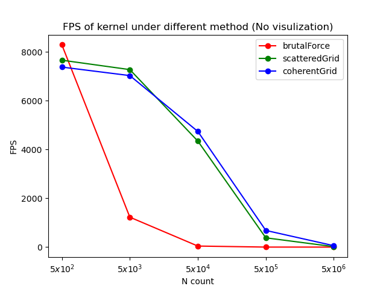
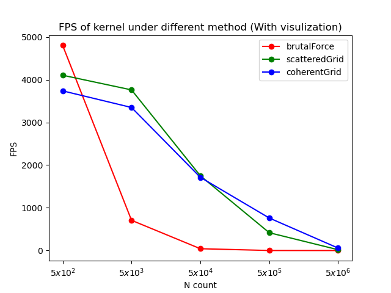
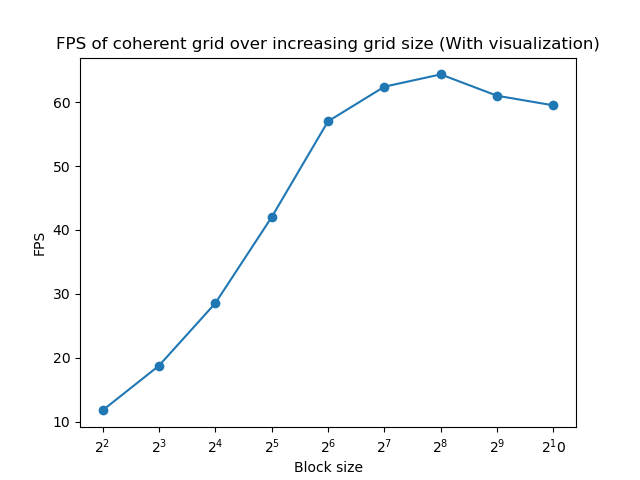
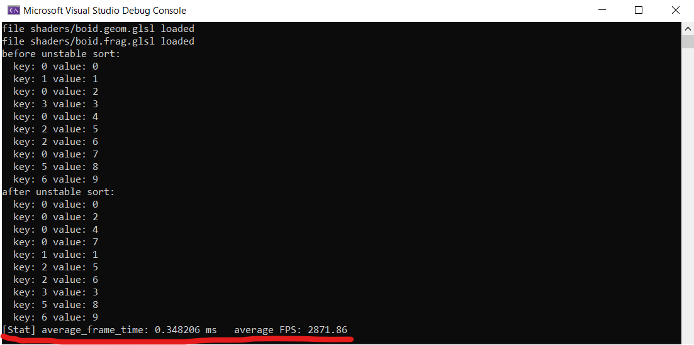
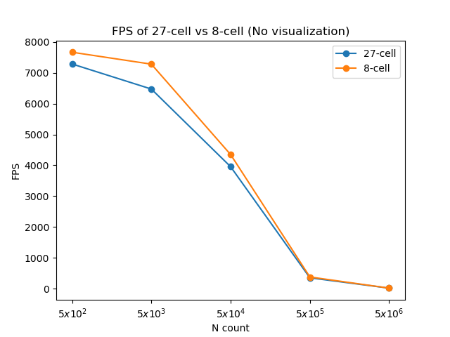

**University of Pennsylvania, CIS 565: GPU Programming and Architecture,
Project 1 - Flocking**

* Yian Chen
  * [LinkedIn](https://www.linkedin.com/in/yian-chen-33a31a1a8/), [personal website](https://sydianandrewchen.github.io/) etc.
* Tested on: Windows 10, AMD Ryzen 5800 HS with Radeon Graphics CPU @ 3.20GHz 16GB, NVIDIA GeForce RTX3060 Laptop 8GB


### Banner

* `N_FOR_VIS = 5,000; scene_scale=100.0f`


* `N_FOR_VIS = 500,000; scene_scale=200.0f`


* `N_FOR_VIS = 2,000,000; scene_scale=600.0f`


### Performance Analysis

#### Results

- Framerate change with increasing # of boids for naive, scattered uniform grid, and coherent uniform grid (with and without visualization)


- Framerate change with increasing block size


#### Analysis Methods

- `cudaEvent_t` is used to record the performance of each implementation under different cases.

```cpp
runCuda
{

    ... // before kernel

    #if CUDA_PROFILING
    cudaEventRecord(start);
    #endif

    // execute the kernel
    #if UNIFORM_GRID && COHERENT_GRID
    Boids::stepSimulationCoherentGrid(DT);
    #elif UNIFORM_GRID
    Boids::stepSimulationScatteredGrid(DT);
    #else
    Boids::stepSimulationNaive(DT);
    #endif

    #if CUDA_PROFILING
        cudaEventRecord(stop);
        cudaEventSynchronize(stop);
        float milliseconds = 0;
        cudaEventElapsedTime(&milliseconds, start, stop);
        //std::cout << milliseconds << std::endl;
        elapsed_frame++;
        elapsed_time += milliseconds;
    #endif
    ... // after kernel
}

mainLoop
{
  while (...){
    ... 
  } // after quitting mainLoop
  #if CUDA_PROFILING
      float average_frame_time = std::max(elapsed_time / elapsed_frame, FLT_EPSILON);
      std::cout 
        << "[Stat] average_frame_time: " 
        << average_frame_time << " ms   average FPS: " 
        << 1000. / average_frame_time << "\n";
      cudaEventDestroy(start);
      cudaEventDestroy(stop);
  #endif
}
```

- To enable tight profiling, enable `CUDA_PROFILING` macro. After quitting the simulation, the average FPS should be printed to the standard output.



#### Questions

* For each implementation, how does changing the number of boids affect performance? Why do you think this is?
  * For all implementation, increasing the number of boids will decrease performance. This is because the required calculations increase and the memory required also increase along with the increasing number of boids.

* For each implementation, how does changing the block count and block size affect performance? Why do you think this is?
  * As block size increases, the performance will first increase then decrease. The increasing blockSize brings higher parallelism, along with higher memory usage within each thread. As the register of each thread is limited, this will surely increase the io of local/global memory more often, thus slower the execution of each thread.

* For the coherent uniform grid: did you experience any performance improvements with the more coherent uniform grid? Was this the outcome you expected? Why or why not?
  * The performace improvements did not occur until the number of boids is increased to a certain amount. This should be the case. In a rather small amount of boids, the time saved by the coherent array is not higher than the time used to reallocate the array. 
* Did changing cell width and checking 27 vs 8 neighboring cells affect performance? Why or why not? Be careful: it is insufficient (and possibly incorrect) to say that 27-cell is slower simply because there are more cells to check!
  * Yes. According to the stats, 27 neighboring slows down performance mainly at a middle amount of boids. 27-cell is slower mainly because there are a lot of waste spent on checking irrelevant cells. There are at least 19 cells we can ensure that no adjacent boids are in.
  
