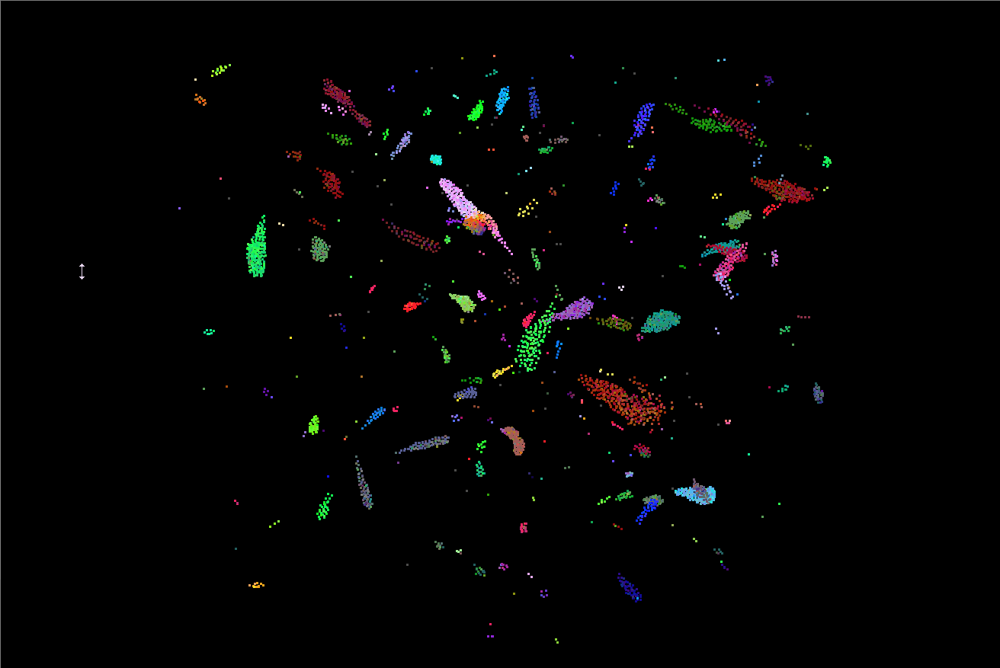
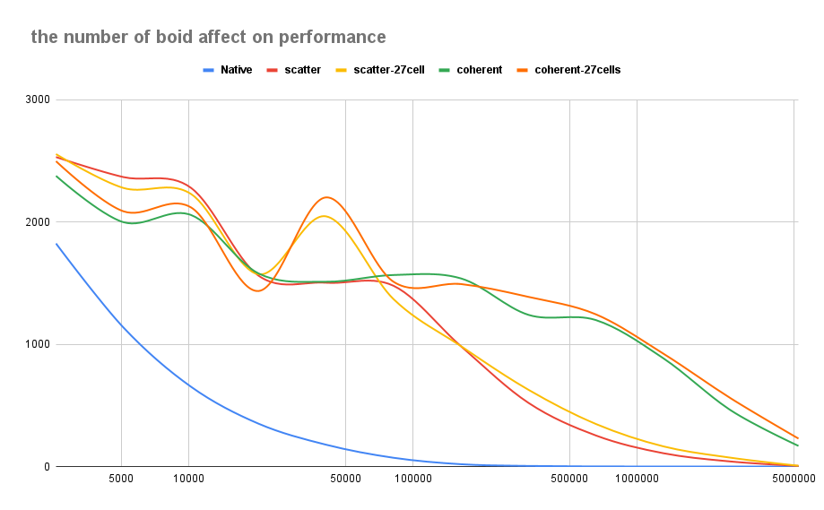
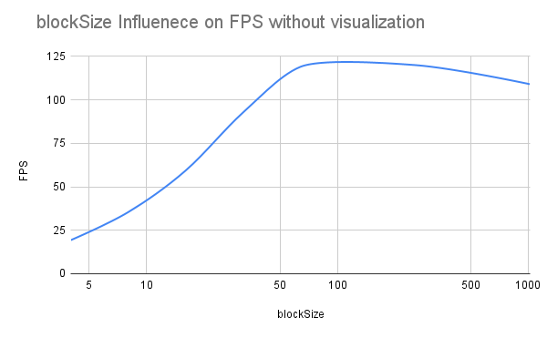
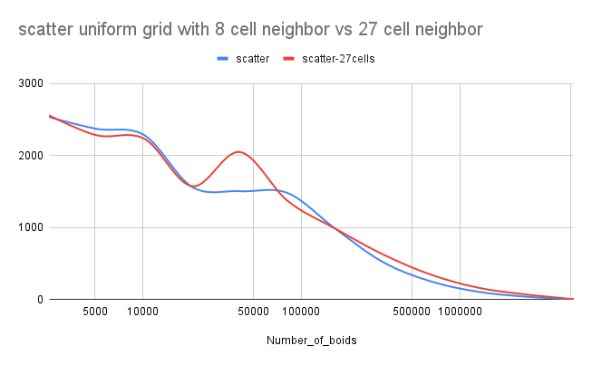
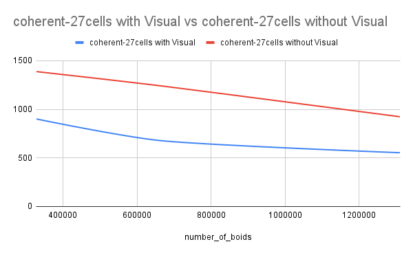

**University of Pennsylvania, CIS 565: GPU Programming and Architecture,
Project 1 - Flocking**

* Xitong Zheng
  * (TODO) [LinkedIn](https://www.linkedin.com/in/xitong-zheng-5b6543205/), [Instagram](https://www.instagram.com/simonz_zheng/), etc.
* Tested on: Windows 11, i7-12700k 32GB, GTX 4090 24GB

### Simulation Photo
- NumofBoids = 5000; scene_scale = 200.f

- NumofBoids = 512000; scene_scale = 200.f

- NumofBoids = 20480000; scene_scale = 200.f

### Performance Analysis

#### FramePerSecond vs Boid Number (without Visualization mode)

128 blockSize, no visualization
The X-axis is the log(number_of_boids) and the Y-axis is the FPS in linear.

From the above picture, it can be concluded that generally, the bigger the number of boids it is, the smaller FPS it will be gained. Despite that there is abnoraml points for 27cells grid search with scatter uniform grid and coherent uniform grid that perform unexpectedly well. All other data points in every simulation mode shows that boids number decrease the performance which is the fps. You can observe the trend perfectly in the naive simulation mode.

The reason for that is simple, that is when there are more boids to simulate, there are more boids with in the force-related distance. So for every boid(thread), there are more global memory access and higher compute intensity. As for the abnormally high points around 50000k boids with 27 cells, I may need further analyze with Nsight. I believe that the kernel performance is limited by the global memory access so maybe the grid-27-cell method somehow decrease the global memory acces out of certain reason 

#### FPS vs BlockSize (without Visualization mode)

The x-axis is the log(blockSize) and the y-axis is the FPS. To illustrate how blockSize and blockCount can affeat the performance, I choose I relatively large number of boids, around 10,000,000 so that the L1cache can be exhausted.

From the picture, the FPS increase when the blockSize become bigger initially and then decrease slightly when the blockSize reach the point 64. It can be explained by when the blcokSize is increase from the early stage, the data parallism increase as there are more wraps assigned to a SM so that read and store vs compute ratio increase. It can also be understood as parallism increase. But the L1 cache space is limited within a SM, so that when blockSize increase, cache for every thread is decreased. In this way, caching becomes less effective and global memory access increase, thus lower the performance.

#### Q3: For the coherent uniform grid: any performance improvements with the more coherent uniform grid? Was this the outcome you expected? Why or why not?

Ans: 
From `the number boids affect on performance` picture above or from the picture below, it can be found that more coherent uniform grid does not neccesarily bring improvement until the number of boids is bigger than 1000,000. Only when the numbe is quite large, the effectness becomes obvious. This may because for smaller number of boids, the save global memory access is not obvious as there is not quite a lot boids nearby. Also, reranging the buffer can still be a cost at the case so the improvement is not obvious.

#### Q4: Did changing cell width and checking 27 vs 8 neighboring cells affect performance? Why or why not?
Yes. To be clear, Grid_27_search is of `1.0 * maximum_distance` and check 3 * 3 * 3 grids while for Grid_8_search is of `2.0 * maximum_distance` and check 2 * 2 * 2 grids. From the picture, it can be observed that the advantage of 27 cells over 8 cells is not obviously and in effect, it may decrease the performance case by case. Only when the number of boids is larger than 3000,000, you can clear see that 27 neighboring bring significant improvement on performance.

Reason: 1.When boids density is smaller, 27_cell may waste lots of global memory access checking grids with few boids so 8_cell save access. 2But when boids density is bigger, 27_cell save access because it basically search a smaller region than 8_cell so that the boids compared are more closed to the max_distance which save comparison.

The first reason can also explain that it is not better to do more grids separation as I try `0.5 * maximum_distance` in the grid loop optimization but only find that it decrease the performance.

#### Appendix:  Comparison between coherent simulation with visualiazation and without
