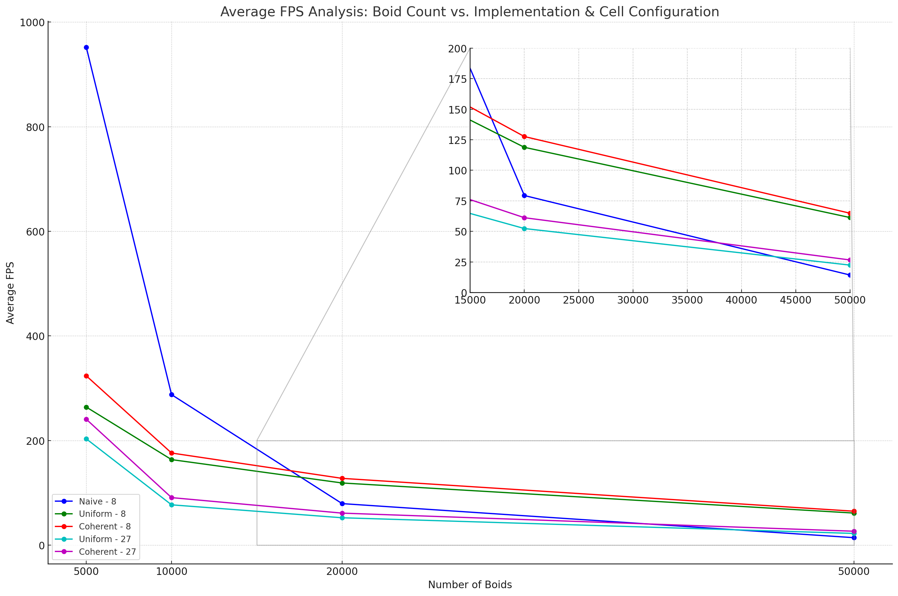
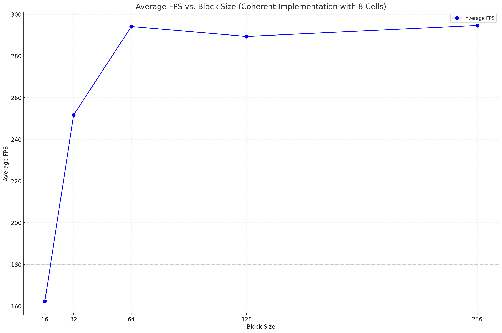

**University of Pennsylvania, CIS 565: GPU Programming and Architecture,
Project 1 - Flocking**

* Yinuo (Travis) Xie
  * [LinkedIn](https://www.linkedin.com/in/yinuotxie/)
* Tested on: Windows 10, i7-12700 @2.10GHz 32GB, NVIDIA T1000 (Moore Windows PC Lab)


# Flocking Simulation

## Table of Contents

* [Overview](#overview)
* [How We Built the Flocking Simulation](#how-we-built-the-flocking-simulation)
* [Performance Analysis](#performance-analysis)
* [Bloopers](#bloopers)

## Overview

### What is the Flocking Simulation?

Imagine watching a group of birds flying together in harmony, almost like a choreographed dance in the sky. That mesmerizing pattern is what this project replicates. The concept behind it is based on the [Reynolds Boid model](https://en.wikipedia.org/wiki/Boids), a model that explains how individual elements (like birds) move when they are part of a larger group.

### How Does it Work?

This simulation uses three simple rules to create complex patterns:

1. **Stay Together** - Each bird, or "boid," moves towards the average position of its neighbors, not counting itself.
2. **Don't Crowd** - Boids try to maintain a certain distance from each other, ensuring they don't bump into one another.
3. **Fly Similarly** - Boids try to fly at the same speed as their nearby companions, creating a harmonized movement.

### Technical Details

- The simulation is designed using advanced programming techniques with CUDA and OpenGL.
* It's further optimized using methods called a 'uniform grid' and 'semi-coherent memory access' for smooth performance.

### Preview

Below is a quick glimpse of the simulation with a whopping 100,000 boids in action!


## How We Built the Flocking Simulation

To craft the enthralling pattern of birds in flight, we utilized three distinct techniques. Let's delve deeper into each:

### 1. **Naive Approach**

This is the simplest of the methods, often referred to as a brute-force approach.
* **Process**:
  * Every single boid examines every other boid in the environment to determine how it should move.
  * For each bird, the system calculates several parameters:
    * The **Center of Mass** - Represents the average position of all boids excluding the current one.
    * **Average Speed** - Denotes the mean speed of all the other birds.
    * **Nearby Boids** - Identifies birds that are within a specific distance to avoid collisions.
  * With these calculations, the simulation adjusts the position and velocity of each bird according to our main rules.
  
📂 **Code File**: `kernel.cu`  
🔗 **Function**: `kernUpdateVelocityBruteForce`

### 2. **Uniform Grid Method**

A sophisticated method that optimizes the naive approach using spatial partitioning.
* **Process**:
  * The system first visualizes all boids within a bounding box to understand their distribution.
  * A grid, with each cell sized to match a boid's movement range, overlays this bounding box.
  * Every boid is assigned to a grid cell based on its position.
  * Rather than inspecting every boid in the environment, a bird now only looks at those within its cell and its direct neighbors. This reduces the number of comparisons and speeds up the calculations.
  * Using this reduced set, the boid's next position and speed adjustments get computed.
  
📂 **Code File**: `kernel.cu`  
🔗 **Function**: `kernUpdateVelNeighborSearchScattered`

### 3. **Coherent Uniform Grid**

A further optimization of the grid technique for superior efficiency.
* **Process**:
  * It shares many steps with the Uniform Grid method.
  * The major difference comes after grid assignment. In this approach, boids are rearranged in memory to group those in the same grid cell together. This results in what we call 'coherent' memory access.
  * Why is this beneficial? When the simulation accesses the data of one boid in a cell, fetching data for other boids in the same cell becomes faster, thanks to memory locality. This boosts the overall simulation performance.
  
📂 **Code File**: `kernel.cu`  
🔗 **Function**: `kernUpdateVelNeighborSearchCoherent`


## Performance Analysis

To gauge the efficacy of each flocking simulation approach, we meticulously performed an array of tests. The insights derived provide a robust understanding of each method's merits and areas of potential improvement.

### 1. **Impact of Boid Count on Performance**

#### Graphical Representation
The subsequent graph illustrates the performance effects of varying boid counts for the naive, uniform grid, and coherent uniform grid techniques, considering different cell search configurations.


#### Observations

* **Naive Approach**: As the number of boids increased, the naive approach exhibited a decline in performance. This is anticipated since it involves checking every boid against every other, resulting in quadratic complexity.

* **Uniform Grid**: Performance improvements became more pronounced as the number of boids escalated. The grid method curtails unnecessary checks by examining only boids in proximate cells. However, when the boid count is relatively low, the overhead of establishing and managing the grid might offset the benefits.

* **Coherent Uniform Grid**: Similar to the Uniform Grid approach, this method becomes particularly advantageous with higher boid counts. The strategic memory arrangement further enhances this optimization.

### 2. **Influence of Block Count & Size on Performance**

#### Graphical Representation
The graph below showcases how block count and size influence performance when using the coherent uniform grid method with 10,000 boids searching across 8 cells



#### Observations

- As the block size is amplified, performance undergoes a spike, plateauing once the block size reaches 64 for the Nvidia T1000. The GPU can process 1,024 threads per block across its 16 SMs. Thus, the potential for concurrent blocks is capped at 16, limiting further gains with block sizes surpassing 64.

### 3. **Efficacy of the Coherent Uniform Grid**

The Coherent Grid approach demonstrated a notable boost in performance relative to the standard Uniform Grid. By systematically aligning boids in memory according to their cell allocations, we managed to achieve a more efficient memory access pattern. While this strategy did lead to better outcomes, the improvement was not as remarkable as initially anticipated. The subtler enhancement can potentially be attributed to:

* A boid count that might not have been sufficiently large to fully leverage the Coherent Grid's capabilities.
* A grid size that might have been too restricted to truly showcase the strengths of a Coherent Grid.

### 4. **Cell Width & Neighboring Cells' Impact**

Fine-tuning the cell width and analyzing performance variances between the 27-cell and 8-cell checks yielded results largely within expectations. The 8-cell inspection was indeed swifter than its 27-cell counterpart. Nonetheless, the 27-cell examination, with its broader scope, naturally consumed more computational power. The trade-off here is between speed and thoroughness. Depending on specific scenarios, such as boid density and spatial distribution, a meticulous 27-cell review could be essential to maintain simulation precision.

## Bloopers

Throughout the project's lifecycle, I encountered a series of hurdles which, although testing my patience, provided valuable learning moments.

During my attempt to set up the coherent grid approach, I stumbled upon an issue where `kernComputeIndices` produced a frustrating "illegal access to the memory" error. The root of this issue was a rather simple oversight: during the initialization of `gridStartIndices` and `gridEndIndices`, I mistakenly allocated memory based on the number of boids, rather than the number of cells.

The erroneous implementation looked like this:

```cpp
cudaMalloc((void**)&dev_gridCellStartIndices, N * sizeof(int));
checkCUDAErrorWithLine("cudaMalloc dev_gridCellStartIndices failed!");

cudaMalloc((void**)&dev_gridCellEndIndices, N * sizeof(int));
checkCUDAErrorWithLine("cudaMalloc dev_gridCellEndIndices failed!");
```

The corrected version, which rectified the issue, is:

```cpp
cudaMalloc((void**)&dev_gridCellStartIndices, gridCellCount * sizeof(int));
checkCUDAErrorWithLine("cudaMalloc dev_gridCellStartIndices failed!");

cudaMalloc((void**)&dev_gridCellEndIndices, gridCellCount * sizeof(int));
checkCUDAErrorWithLine("cudaMalloc dev_gridCellEndIndices failed!");
```

Intriguingly, the flawed implementation didn't raise any flags during the uniform grid approach. The reasons for this anomaly became an additional layer of exploration as I sought to understand the nuances of the two methods.
