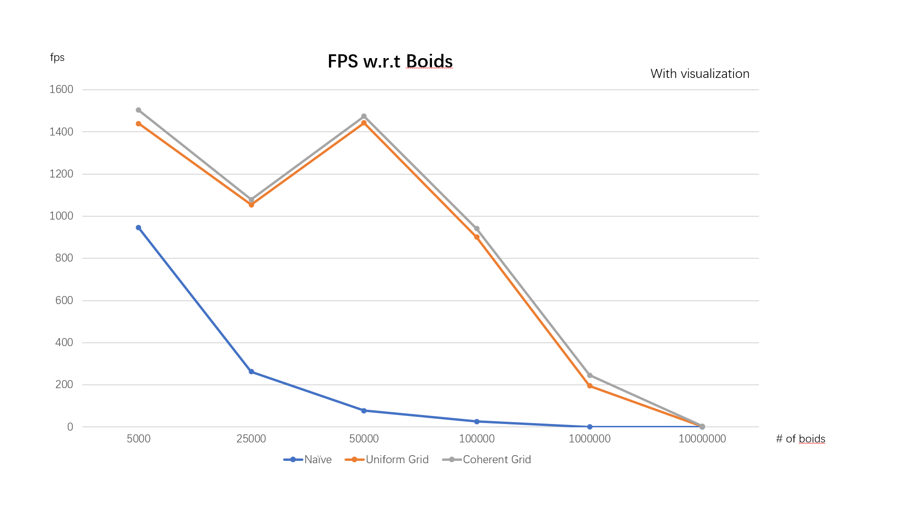
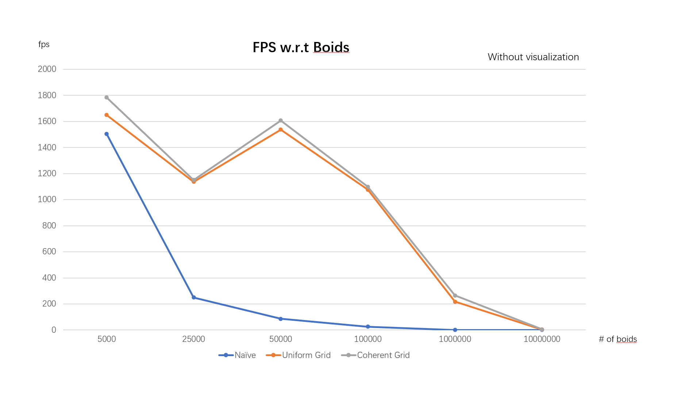
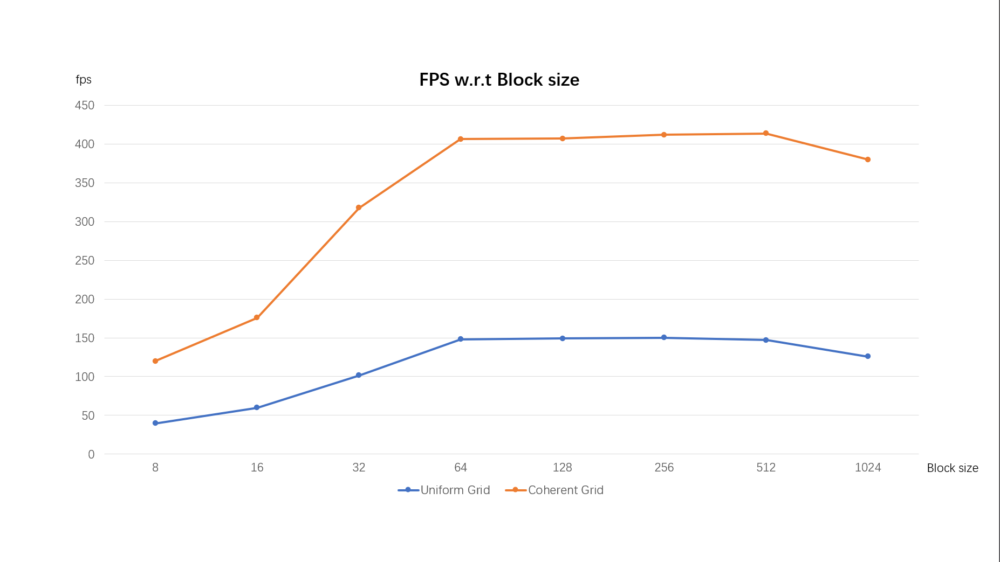
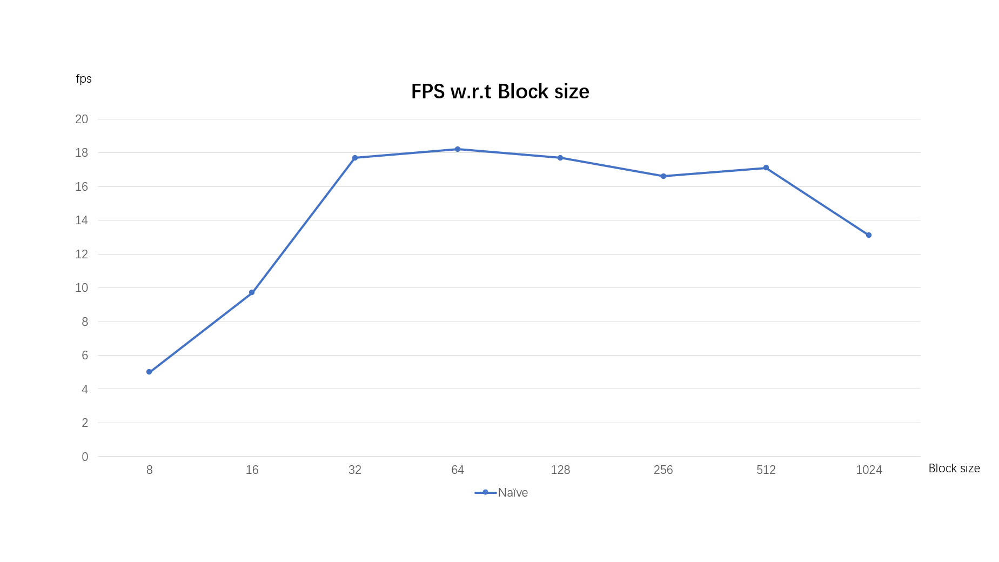
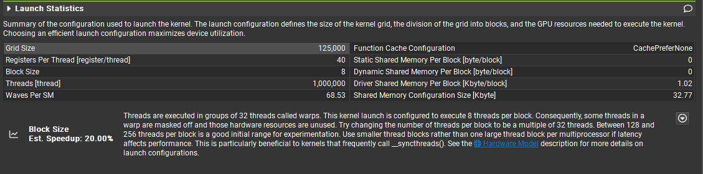
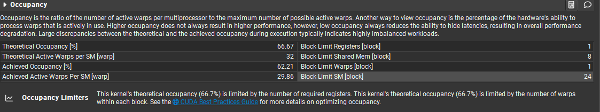
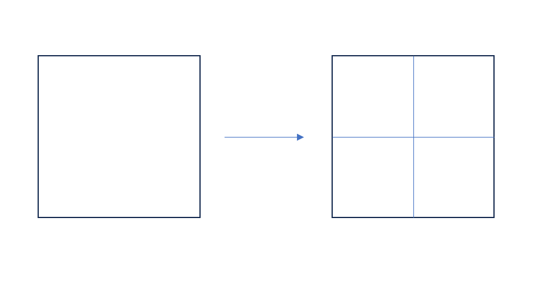
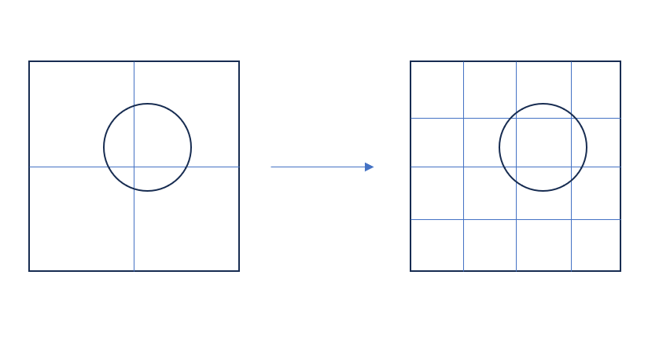

**University of Pennsylvania, CIS 565: GPU Programming and Architecture,
Project 1 - Flocking**

* Mengxuan Huang
  * [LinkedIn](https://www.linkedin.com/in/mengxuan-huang-52881624a/)
* Tested on: Windows 11, i9-13980HX @ 2.22GHz 64.0 GB, RTX4090-Laptop 16384MB

## Outcome Summary
**Record in coherent grid mode** 
||boid = 5000 |boid = 100000| boid = 10000000|
|------------- |-------------|-------------|-------------|
|scene scale = 100.f||||

||boid = 100000 |boid = 1000000| boid = 10000000|
|------------- |-------------|-------------|-------------|
|scene scale = 500.f||||

## Performance Analysis
In general, with the increase of the number of boids, the frame rate drops. When the number of boid is large (like 10000000), increasing the scene scale (increase the number of grid) can improve the frame rate.

- ### For each implementation, how does changing the number of boids affect performance? Why do you think this is?
|Block Size|Scene Scale|
|-----------|----------- |
|128|100.0|

|With Visualization|Without Visualization|
|-----------|-----------|
|||

According to the statistic result, 
- **Naive method**: the fps drops with the increase of the number of boids.
- **Uniform Grid method**: the fps drops with the increase of the number of boids, except when there are 25000 boids.
- **Coherent Grid method**: the fps drops with the increase of the number of boids, except when there are 25000 boids.

For the **Naive method**, each boid needs to traverse all boids when update velocity. While for the **Uniform Grid** and **Coherent Grid** method, each boid just traverse boids locating its neighbor grids. The increase of the number of the boids causes to the significant drop of fps for **Naive method**. **Uniform Grid** and **Coherent Grid** methods divide the scene into grids which also divide the increase of the number of the boids, and therefore make the fps drop moderately.

Besides, there is a "middleman", which related to an extra indirect addressing, in **Uniform Grid** method while compared to the **Coherent Grid** method. Therefore, for the performance, **Coherent Grid** > **Uniform Grid** > **Naive method**.

Finally, for the abnormal fps drop at **boids = 25000**, This might because there are not enough boids in neighbor grids and there is not enough computation to hide memory latency.

- ### For each implementation, how does changing the block count and block size affect performance? Why do you think this is?
|Scene Scale|With Visualization|
|-----------|-----------|
|100.0|No|

To record a stable fps, I tested the **Naive method** on 100000 boids while tested **Uniform Grid** and **Coherent Grid** on 1000000 boids.

|1000000 Boids|100000 Boids|
|-----------|-----------|
|||

According to the statistic result, in all three methods, the fps increase when increase the size of block, the fps firstly increase (from 8 to 32), subsequently keep stable (from 32 to 512), and finally drop (from 512 to 1024).

According to the NSight Compute profile result, when block size is small, which is smaller than 32, ***some threads in a warp are masked off and those hardware resources are unused***. Thus, fps increase with the increase of block size when it is smaller than 32.

According to the NSight Compute profile result, when block size is large, since the total number of register in each SM is limited, the number of active thread is limited, which leads to the performance drop. 

- ### For the coherent uniform grid: did you experience any performance improvements with the more coherent uniform grid? Was this the outcome you expected? Why or why not?

|Block Size|# of Boids|
|-----------|----------- |
|128|10000000.0|

|scene scale = 100.0|scene scale = 500.0|
|-----------|-----------|
|||

As shown in the gif, under the condition that **10000000 Boids**, there is a significant improvement in fps when scene scale changed from 100 to 500, which is because larger scene scale leads to more grids and less boids per grid, and therefore less neighbor traverse time for each boid. 

- ### Did changing cell width and checking 27 vs 8 neighboring cells affect performance?
|Block Size|# of Boids|Scene scale|Method|
|-----------|-----------|-----------|-----------|
|128|2000000|100.0|Coherent Grid|

||8 neighboring cells|27 neighboring cells|
|-----------|-----------|-----------|
|fps|80.1|131.2|

According to the testing result, when check 27 neighbor grids, there is a significant fps improvement! This might because we ***halved the grid cell width***:

And therefore,

The search area become smaller, which means less boids each boid need to traverse. Therefore, the seaching become more efficient.
