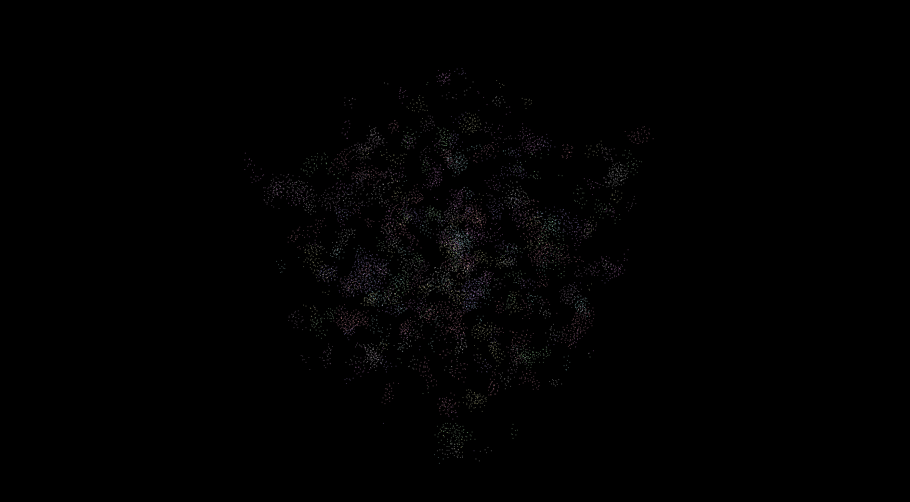
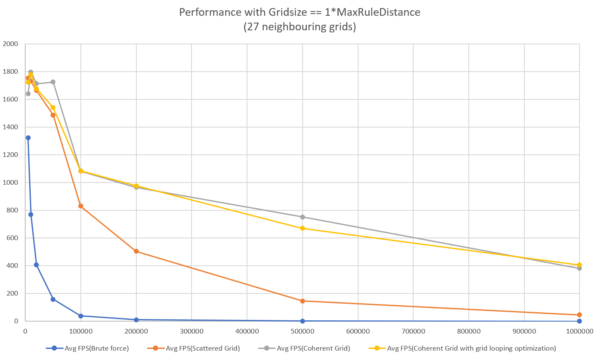
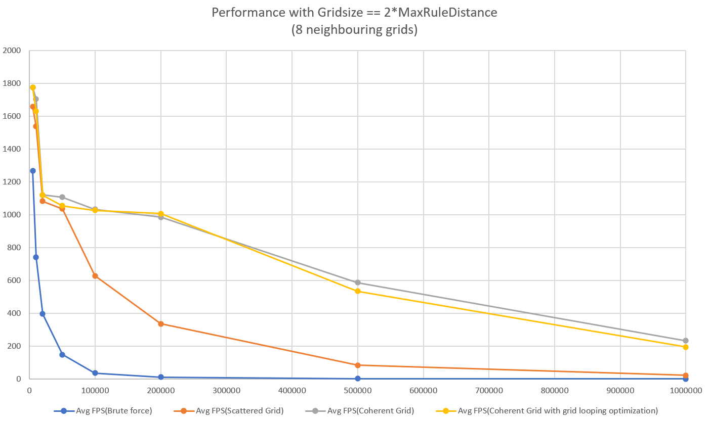
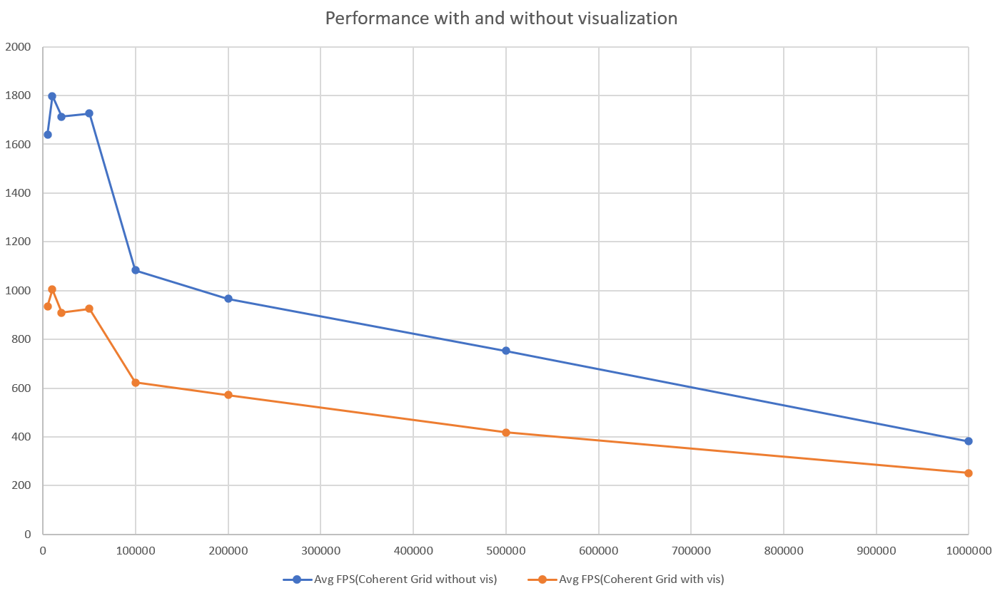
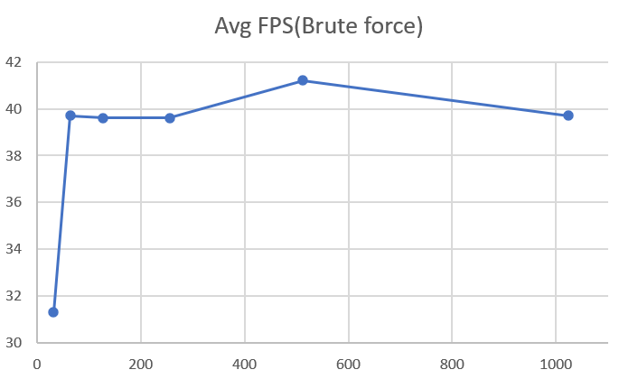
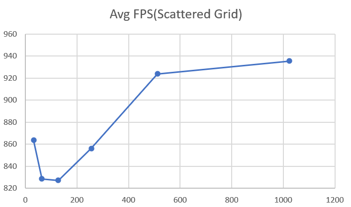
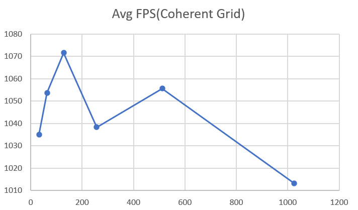
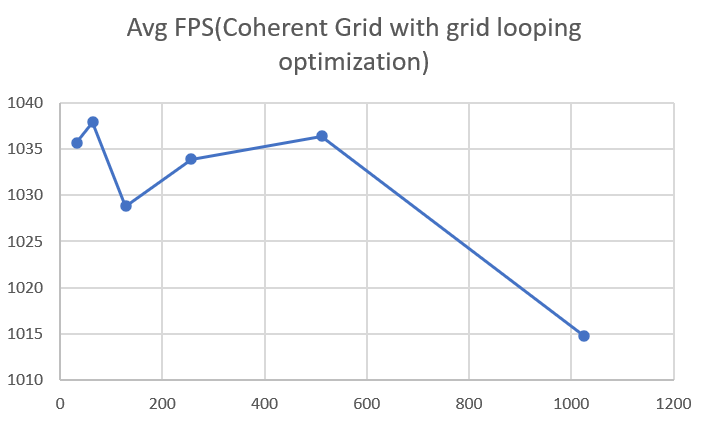
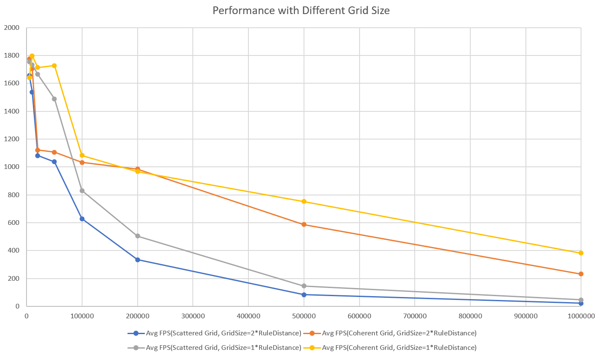

**University of Pennsylvania, CIS 565: GPU Programming and Architecture,
Project 1 - Flocking**

* Han Yang
  *  [LinkedIn](https://www.linkedin.com/in/han-yang-0031231a3/), [personal website](https://bdwhst.wixsite.com/portfolio), etc.
* Tested on: Windows 11, i9-12900HX @ 2.30GHz 16GB, RTX4080 laptop 12GB

### Principles

- Rule 1: Boids try to fly towards the centre of mass of neighbouring boids

- Rule 2: Boids try to keep a small distance away from other objects (including other boids).

- Rule 3: Boids try to match velocity with near boids.

  See instruction.md for more.

### Macros

`SINGLE_MAX_DISTANCE_GRID`: in kernel.cu, set grid size to max_distance when set to 1, else 2*max_distance

`GRIDLOOP_OPT`: in main.cpp, switch for grid looping optimization for coherent grid

### Showcase

### Performance Analysis

#### 1: Performance with different # of boids (Gridsize==1*MaxRuleDistance, No visual)

| # of boids | Avg FPS(Brute force) | Avg FPS(Scattered Grid) | Avg FPS(Coherent Grid) | Avg FPS(Coherent Grid with grid looping  optimization) |
| ---------- | -------------------- | ----------------------- | ---------------------- | ------------------------------------------------------ |
| 5000       | 1325.4               | 1754.2                  | 1639.6                 | 1723                                                   |
| 10000      | 768.7                | 1732.7                  | 1798.4                 | 1778.6                                                 |
| 20000      | 406.2                | 1664.9                  | 1713.7                 | 1679.1                                                 |
| 50000      | 159                  | 1488.3                  | 1726.8                 | 1542                                                   |
| 100000     | 38.3                 | 830.8                   | 1083                   | 1084.1                                                 |
| 200000     | 10.9                 | 504.3                   | 966.4                  | 977.8                                                  |
| 500000     | 1.8                  | 146.8                   | 752.8                  | 670.4                                                  |
| 1000000    | 0.5                  | 46.1                    | 381.6                  | 406.5                                                  |

#### 2: Performance with different # of boids (Gridsize==2*MaxRuleDistance, No visual)

| # of boids | Avg FPS(Brute force) | Avg FPS(Scattered Grid) | Avg FPS(Coherent Grid) | Avg FPS(Coherent Grid with grid looping  optimization) |
| ---------- | -------------------- | ----------------------- | ---------------------- | ------------------------------------------------------ |
| 5000       | 1267.1               | 1657                    | 1774.3                 | 1774.9                                                 |
| 10000      | 739.9                | 1537.4                  | 1704.4                 | 1631.6                                                 |
| 20000      | 395.6                | 1081.7                  | 1120.7                 | 1119.2                                                 |
| 50000      | 147.9                | 1036.3                  | 1106.4                 | 1054                                                   |
| 100000     | 36.1                 | 628.5                   | 1032.8                 | 1026.3                                                 |
| 200000     | 10                   | 335.2                   | 984.7                  | 1005.7                                                 |
| 500000     | 1.5                  | 82.7                    | 586.8                  | 534.5                                                  |
| 1000000    | 0.4                  | 22.3                    | 232.1                  | 193.5                                                  |

#### 3: Performance with and without visualization (27 neighboring grids, coherent grid)

#### 4: Performance with different blocksize (# of boids=100000)

#### Answer to Questions:

**1.For each implementation, how does changing the number of boids affect**
**performance? Why do you think this is?**

Generally speaking, increasing the number of boids will cause the fps to decrease. This is intuitive, because increasing the number of boids will naturally increase the need for number of threads to simulate them, and on a GPU with limited cores, this will take longer to process. 

**2.For each implementation, how does changing the block count and block size**
**affect performance? Why do you think this is?**

For brute and scatter accessing grid, increase block size will improve performance. I think this is because the memory access latency will be hid by arithmetic operations for a large block size. But with coherent grid, this improvement was inconsequential, because coherent grid access memory almost sequentially, so cache hit will be the most case.

**3.For the coherent uniform grid: did you experience any performance improvements**
**with the more coherent uniform grid? Was this the outcome you expected?**
**Why or why not?**

The improvement with coherent grid was great. This improvement is understandable, since coherent grid performs more coherent and sequential memory access, cache miss rate will be reduced. Memory access latency will be reduced.

**4.Did changing cell width and checking 27 vs 8 neighboring cells affect performance?**
**Why or why not? Be careful: it is insufficient (and possibly incorrect) to say**
**that 27-cell is slower simply because there are more cells to check!**

It did affect performance. Generally performance will be improved. Because when cell width is the twice of the rule distance, there will be some boids that are not actually in the rule distance in the neighbouring 8 cells. But when cell width is just the rule distance, although numbers of cells in the loop will increase, number of boids that needs to be checked will actually decrease. And the denser the simulation field is, the more will this be improved.
