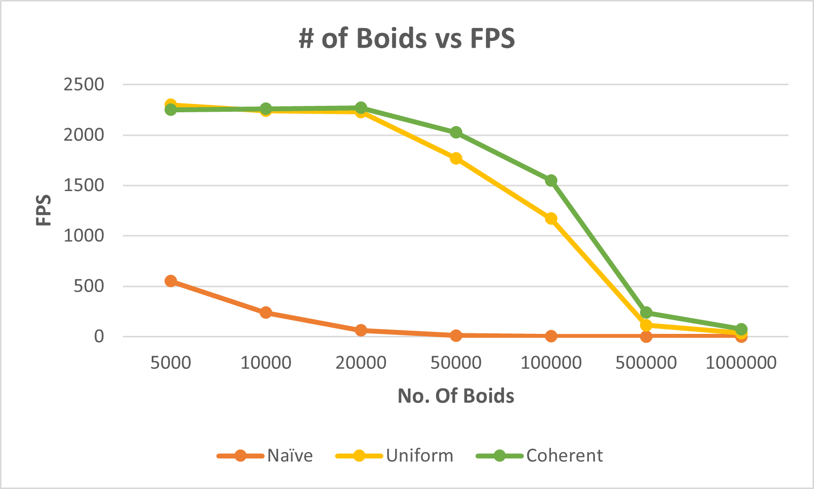
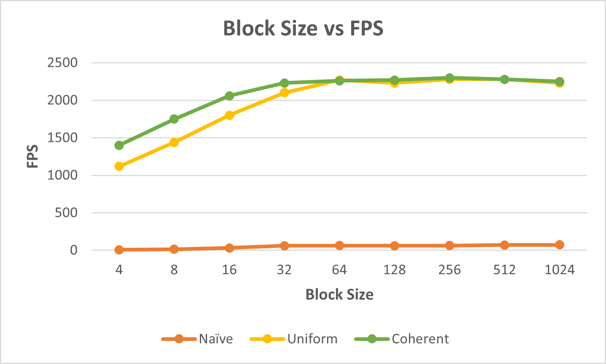
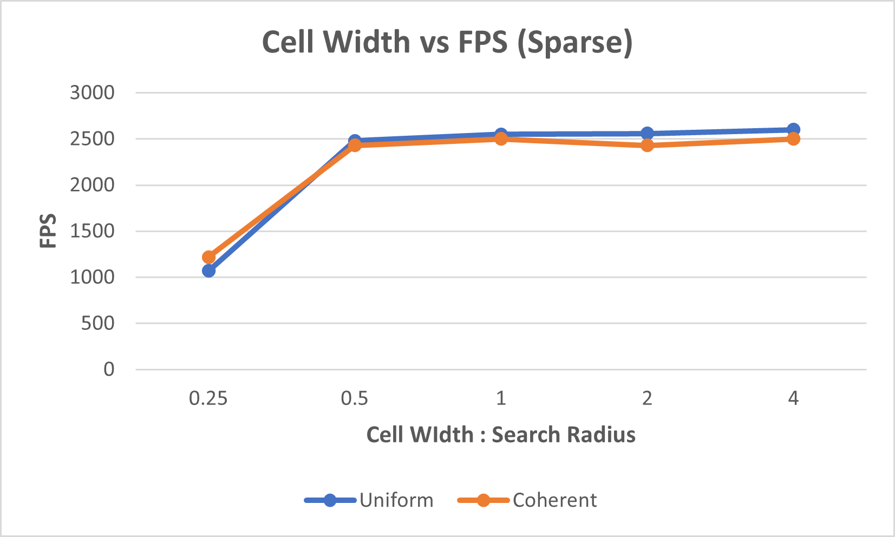
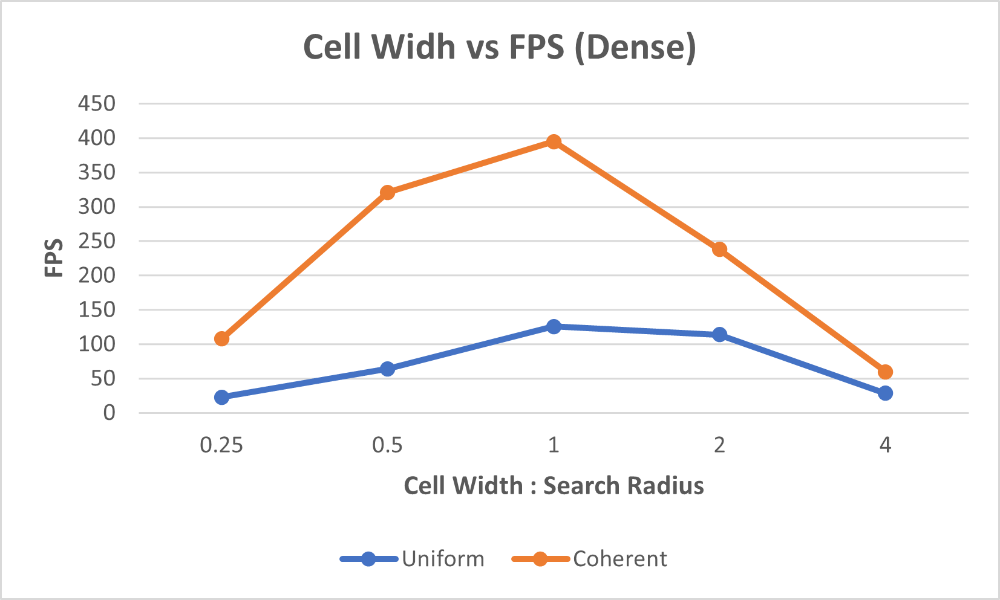

**University of Pennsylvania, CIS 565: GPU Programming and Architecture,
Project 1 - Flocking**

* Saksham Nagpal  
  * [LinkedIn](https://www.linkedin.com/in/nagpalsaksham/)
* Tested on: Windows 11 Home, AMD Ryzen 7 6800H Radeon @ 3.2GHz 16GB, NVIDIA GeForce RTX 3050 Ti Laptop GPU 4096MB

Introduction  
====
This project implements [Craig Reynolds' model](https://www.red3d.com/cwr/boids/) of flocking for boids. The boids, i.e. the particles representing fish or birds, move in accordance with these 3 rules:
1. <b>cohesion:</b> boids move towards the perceived center of mass of their neighbors,
2. <b>separation:</b> boids avoid getting too close to their neighbors, and
3. <b>alignment:</b> boids generally try to move with the same direction and speed as their neighbors.

The final implementation looks something like this:  

More Example Screenshots
====

|  | 
|:--:| 
| *Naive Flocking: 10,000 Boids, Screen Scale 100, 128 Blocks* |

|  | 
|:--:| 
| *Uniform Grid-Based Flocking: 10,000 Boids, Screen Scale 100, 128 Blocks* |

|  | 
|:--:| 
| *Coherent Grid-Based Flocking: 10,000 Boids, Screen Scale 100, 128 Blocks* |

|  | 
|:--:| 
| *Coherent Grid-Based Flocking: 1 Million Boids, Screen Scale 200, 128 Blocks* |

Performance Analysis
===
For capturing an accurate metric reflecting the computational performance, we turn off the visualization of the boids so that the reported frame rate reflects the simulation only.
#### Q: For each implementation, how does changing the number of boids affect performance?
|  | 
|:--:| 
| *Screen Scale 100, 128 Blocks, Cell Width: 2X of Neighbour Search Radius* |

* For the <b>Naive Method</b>, the frame rate drops exponentially as the number of particles increases. This is expected because in this implementation, each particle checks every other particle, and thus the O(n2) algorithm can be held responsible for the fall-off represented in the graph.
* For the <b>Uniform & Coherent Grid-Based Methods</b>, the performance initially remains the same, and in fact increases for a while for the <b>Coherent</b> method. This can be attributed to the reduced search space, and the increase in performance could be from the overhead of removing indirection for sparser grids - as grids become denser, we start seeing the pay-off for removing the indirection before updating velocities for each particle. However, the frame rate falls off for both the methods after a certain point as grids become too dense and the search space starts increasing again.

#### Q: For each implementation, how does changing the block count and block size affect performance? Why do you think this is?
|  | 
|:--:| 
| *Screen Scale 100, 20,000 Boids, Cell Width: 2X of Neighbour Search Radius* |

* The FPS increases up to the point the block size becomes 32. This is because the warp size for NVIDIA graphic cards is 32, and block sizes smaller than that would result in unused threads in each warp, thus requiring more number of cycles.
* Further increasing the block size had little effect on performance, this might be related to the fact that we increased the block size in multiples of 2, and since the warp size is fixed at 32 and the GPU does not necessarily execute all warps of a block in order, the larger blocks were still divided into warps and executed in similar way as the smaller blocks.

#### Q: For the coherent uniform grid: did you experience any performance improvements with the more coherent uniform grid? Was this the outcome you expected?
The coherent grid does perform better than the unifrom grid, especially for larger number of boids. This was indeed the expected outcome, since the indirection layer introduced in the lookup for unifrom grid in the velocity update introduces significant overhead. Making that memory contiguous surely gives a good performance boost. What was interesting to see was the uniform grid performing better for lesser number of boids. This, as talked before, can be attributed to the overhead of removing the indirection layer not contributing enough to offset the performance in its favor for lesser number of boids.

#### Q: Did changing cell width and checking 27 vs 8 neighboring cells affect performance? Why or why not?
|  |
|:--:| 
| *1000 Boids, Screen Scale 100* |

|  |
|:--:| 
| *500,000 Boids, Screen Scale 100* |

* For the <b>Sparse</b> case, we see an initial FPS increase but then it remains constant. This makes sense, as the number of particles itself is very less, so the number of searches aren't very large regardless of the grid size.
* For the <b>Dense</b> case, we see an initial FPS increase but then it drops. The increase can be explained by tighter grids having lesser number of boids and therefore resulting in an overall lesser number of checks. But the larger grid sizes begin to introduce more checks per boid, hence the drop in performance.
