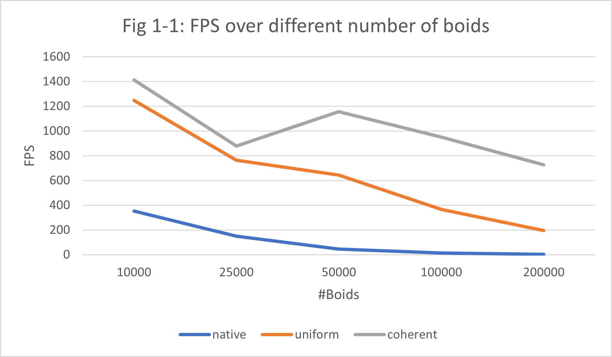
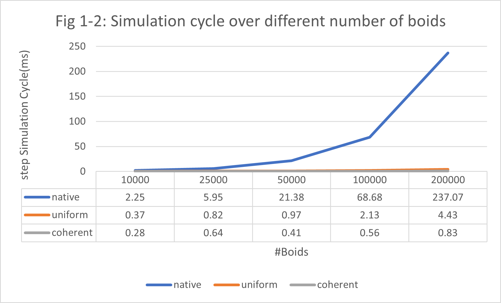
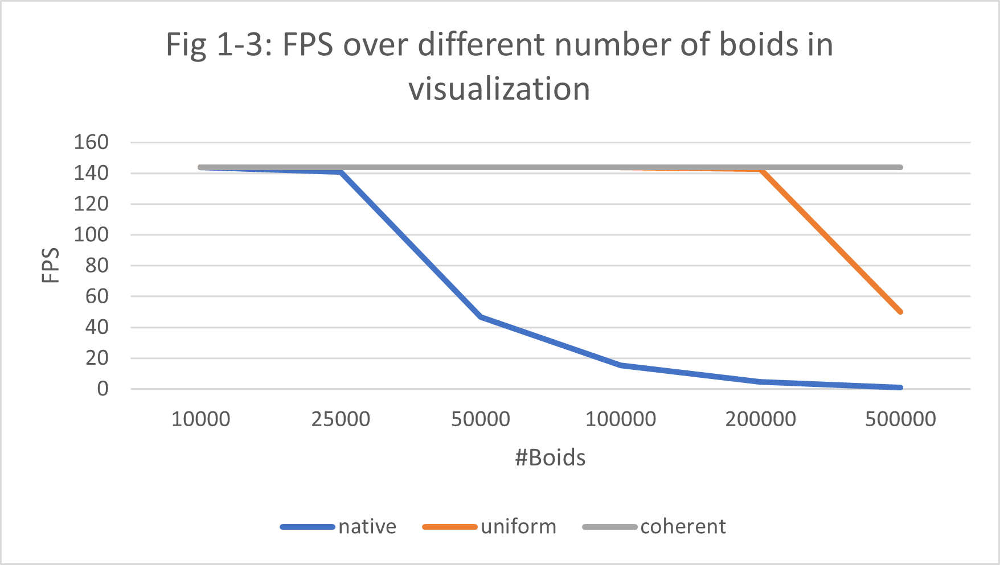
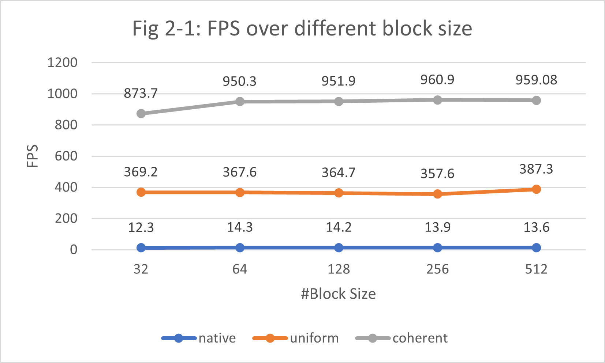
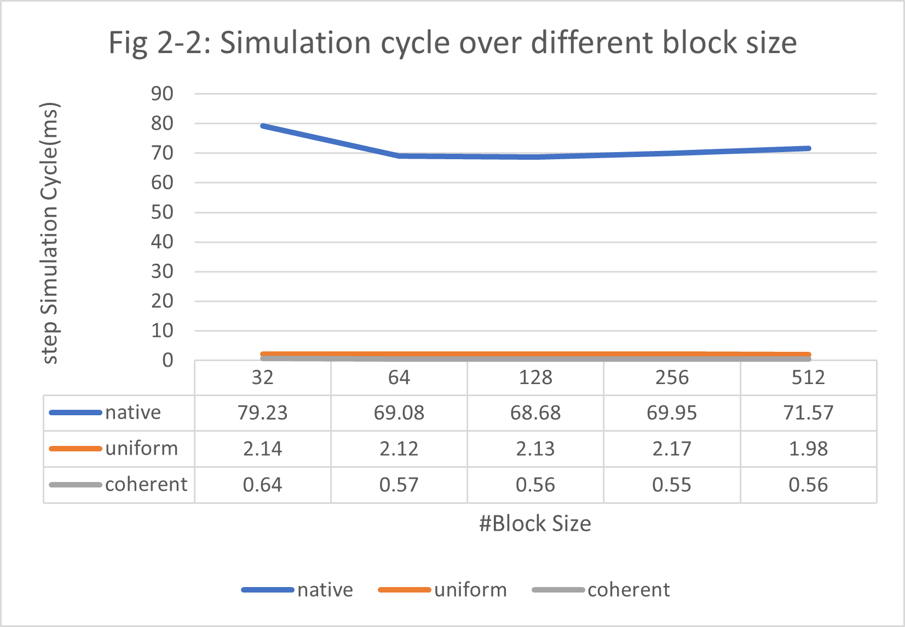

**University of Pennsylvania, CIS 565: GPU Programming and Architecture,
Project 1 - Flocking**

* Yue Zhang
  * [LinkedIn](https://www.linkedin.com/in/yuezhang027/), [personal website](https://yuezhanggame.com/).
* Tested on: Windows 11, i9-13900H @ 2.60GHz 32GB, NVIDIA GeForce RTX 4070 Laptop 8GB (Personal Laptop)
* Compute capability: 8.9

### README

#### Screenshots
Here is several screenshots of the boid in naive simulation with #boids = 10000:

After a period:

Here is the screenshot with sampling frame rate = 60fps about the simulation of 100000 boids with three different methods, just for comparison:

 

 

Those three implementations display an obvious difference in frame rate.

#### Performance Analysis
First, let's discuss the performance metrics used for evaluation. I employ two key indicators to assess each algorithm: The first is the average frame rate, calculated by dividing the number of frames rendered by the sampling time. The second metric is the step simulation cycle, which is measured using CUDA events.

I observed that the frame rate initially fluctuates due to CUDA initialization before entering the main loop. To obtain a more accurate measure, I sampled the frames per second (FPS) and average cycle over a 60 second duration, starting 10 second after the program begins.

I will answer the questions in Performance Analysis section below:

(Note: all experiment is conducted no more than three times, there can be some deviation in the measurement since FPS can vary much in different runs.)

* For each implementation, how does changing the number of boids affect performance? Why do you think this is?

    Here, I run experiment on all three implemented method with different boid counts on the two measuring metrics without visualization. Fig 1-1 and Fig 1-2 demonstrates the line chart of result.

    

    

    We observe that each successive method tends to overestimate its predecessor based on both metrics. As the number of boids increases, the performance of all methods generally declines due to rising computational costs from neighbour searching.
    
    Interestingly, at 50,000 boids, the coherent methods show an unexpected performance spike. I hypothesize that this is due to a trade-off between the cost of rearrangement and spatial continuity in memory access. As the number of boids grows, the significance of efficient memory rearrangement also escalates due to greater memory access demands.

    

    Here's another FPS chart comparing three methods when visualization is enabled. Due to the frame rate limit of my monitor, the maximum achievable frame rate is 144. The uniform grid and coherent methods perform exceptionally well, especially with a high number of boids. As the boid count increases, the memory rearrangement optimization significantly enhances performance.

* For each implementation, how does changing the block count and block size affect performance? Why do you think this is?

    Continuing from our previous discussion, I will present two charts to illustrate how different block sizes affect the measurement metrics. The experiment is conducted under #boids = 100000.

    

    
  
    Different from number of boids, change in number of blocks doesn't effect a lot in the final evaluation. For each number of boids, there should be a suitable blocksize to balance the workload for all Streaming Multiprocessors. Thus, search for suitable block size should involve some control variable experiments similiar to this. In this case, 128 could be a suitable block size.

* For the coherent uniform grid: did you experience any performance improvements with the more coherent uniform grid? Was this the outcome you expected? Why or why not?

    Compared to other methods, the coherent uniform grid approach significantly outperforms them. This method reduces accesses to the shared memory dev_particleArrayIndices and enhances spatial continuity, thereby reducing cache misses and high-cost memory accesses. This result conforms to the optimization purpose of this algorithm.

* Did changing cell width and checking 27 vs 8 neighboring cells affect performance? Why or why not? Be careful: it is insufficient (and possibly incorrect) to say that 27-cell is slower simply because there are more cells to check!

    This should be influenced by the order of magnitude of number of boids. I conducted simple coherent grid simulation on both #boids = 100000 and 10000 with two cell widths:
    |   FPS   | #boid = 100000 | #boid = 10000 |
    |----------|----------|----------|
    | 8-cell (2.0 * maxDistance)  | 902.09 | 1411.5 |
    | 27-cell (maxDistance) | 999.4 | 1278.4 |

    When number of boids is large enough, a smaller granularity of cell width will provide a better search since more boids in the cells are contributing to final velocity. Otherwise, when there is sparser boids distributing in the space, there is no need to search more grids for related particles. This involve a balance between particle searching efficiency and shared GPU memory visit.
  