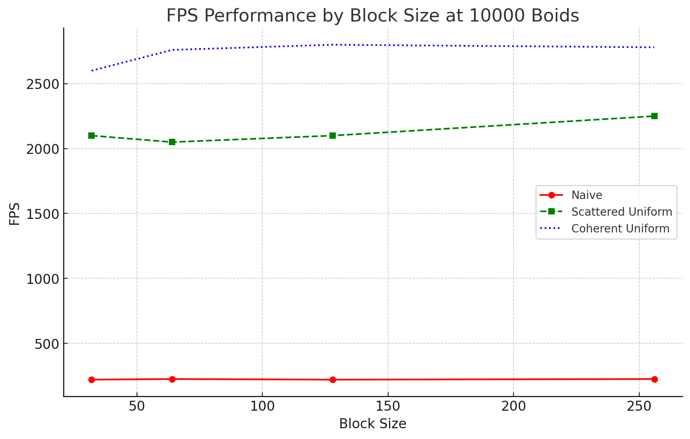

# CIS 565: GPU Programming and Architecture

## Project 1 - Flocking

**Jason Xie**

[🤓 LinkedIn](https://linkedin.com/in/jia-chun-xie)

[😇 my website](https://jchunx.dev)

[🥵 X (formerly 🐦)](https://x.com/codemonke_)

Tested on: Ubuntu 22.04, i5-8400, RTX 3060Ti, personal machine

## Performance Analysis

### FPS vs. Number of Boids

@ block size 128

#### Naive

|# Boids| FPS    |
|-------|--------|
| 1000  | 1900 |
| 10000 |  220   |
| 100000|  6   |

#### Scattered Uniform

|# Boids| FPS    |
|-------|--------|
| 1000  |  4000  |
| 10000 |  2100  |
| 100000|  270   |
| 1000000|  6   |

#### Coherent Uniform

|# Boids| FPS    |
|-------|--------|
| 1000  |  3800  |
| 10000 |  2800  |
| 100000|  280   |
| 1000000|  1    |

### FPS vs. Block Size

@ 10000 boids

#### Naive

|Block Size| FPS    |
|-------|--------|
| 32  |  220  |
| 64 |  225  |
| 128|  220  |
| 256|  225  |

#### Scattered Uniform

|Block Size| FPS    |
|-------|--------|
| 32  |  2100  |
| 64 |  2050  |
| 128|  2100  |
| 256|  2250  |

#### Coherent Uniform

|Block Size| FPS    |
|-------|--------|
| 32  |  2600  |
| 64 |  2760  |
| 128|  2800  |
| 256|  2780  |

## Q&A

### Boids vs. performance

Increasing the number of boids dramatically reduces the framerate. This is due to the quadratic nature of neighbor checking. Using uniform grids reduces the number of checks, resulting in $O(NlogN)$-like performance.

### Blocks vs. performance

For lower block sizes, increasing the number of blocks resulted in higher performance. However, for higher block sizes, increasing the number of blocks resulted in lower performance. For lower block sizes, the number of blocks is not limited by the number of SMs, so increasing the number of blocks increases the number of threads that can be run in parallel. But increasing block sizes further likely introduces more overhead than the performance gained from parallelization.

### Coherent vs. scattered uniform grids

Coherent uniform grids performed generally the same as scattered uniform grids. This is not a very surprising outcome, as the primitive rearrangement kernel simply performed the same swapping operation done on the scattered uniform kernel.

### 27 vs. 8 neighbors

@ 10000 boids, uniform grid, block size 128

|Neighbor Count| FPS    |
|-------|--------|
| 27  |  3140  |
| 8 |  2100  |

Changing cell width and increasing the number of neighbors to 27 resulted in an increase of performance. This is due to the fact that a finer grid results in fewer neighbors outside of the checking radius, resulting in fewer checks.