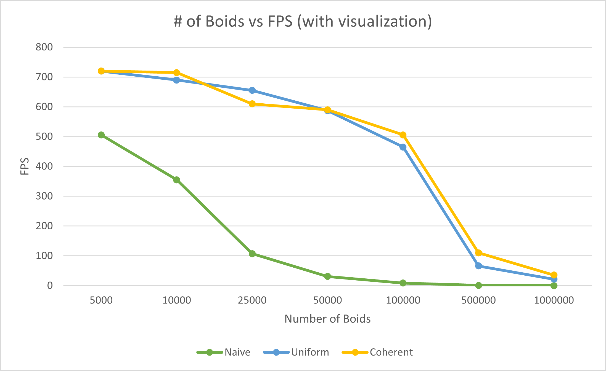
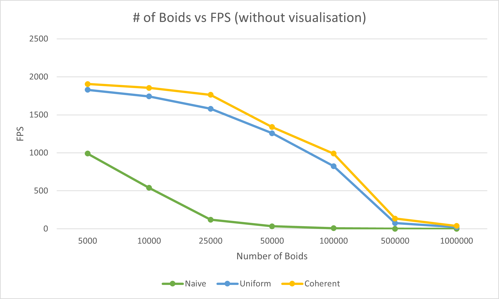
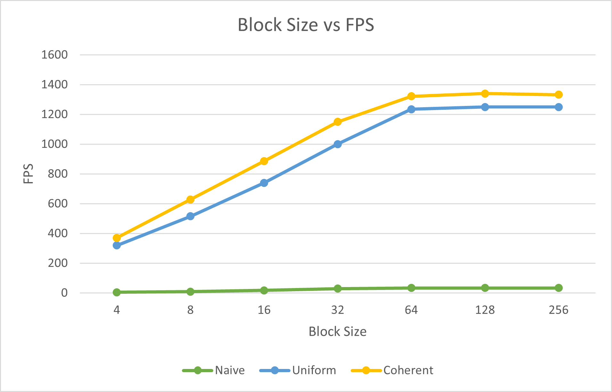

**University of Pennsylvania, CIS 565: GPU Programming and Architecture,
Project 1 - Flocking**

* Utkarsh Dwivedi
  * [LinkedIn](https://www.linkedin.com/in/udwivedi/), [personal website](https://utkarshdwivedi.com/)
* Tested on: Windows 11 Home, AMD Ryzen 7 5800H @ 3.2GHz 16 GB, Nvidia GeForce RTX 3060 Laptop GPU 6000 MB

## Introduction

This project is based on Craig Reynolds' model for flocking of boids. Boids is a term Reynolds used to refer to simulated flocking creatures such as fish schools or bird flocks.

### Rules

These boids follow three simple rules to simulate their movement:

1. <b>Cohesion</b>: boids try to fly towards the perceived center of mass of local neighbours

2. <b>Separation</b>: boids try to steer clear from each other if they get too close

3. <b>Alignment</b>: boids try to match velocity with their neighbours

|  |
|:--:|
| Naive boids simulation: 50,000 boids, scene scale: 100, Number of blocks: 128 |

|  |
|:--:|
| Coherent grid-based boids simulation: 100,000 boids, scene scale: 100, Number of blocks: 128 |

|  |
|:--:|
| Coherent grid-based boids simulation: 1M boids, scene scale: 200, Number of blocks: 128 |

## Methods

This project employs three different methods for implementing the boids simulation:

1. **Naive Method**: In this method, each boid simply checks against every boid to figure out which boids are within a certain neighbourhood distance. This method has O(n2) performance.
2. **Uniform Spatial Grid**: In this method, the entire space is divided into a grid of uniformly spaced cells. Each boid now only needs to check the grid cells that lie within a certain neighbourhood radius of its own cell and then check against the boids within those neighbouring cells, significantly reducing the number of checks and increasing performance. We sort the boid particle array indices based on their grid cell indices, and then use these sorted particle array indices during position and velocity lookups for the boids.
3. **Coherent Spatial Grid**: This is essentially an optimisation layer for the uniform spatial grid. Instead of using the sorted particle array indices, we use additional position and velocity buffers to shuffle the positions and velocities based on grid cell indices, effectively making the position and velocity arrays contiguous based on grid cells.

<table>
  <tr>
    <td align="center"><b>Naive Flocking</b></td>
    <td align="center"><b>Uniform Grid-Based Flocking</b></td>
    <td align="center"><b>Coherent Grid-Based Flocking</b></td>
  </tr>
  <tr>
    <td></td>
    <td></td>
    <td></td>
  </tr>
  <tr>
    <td colspan=3 align="center">10,000 Boids, Scene Scale 100, 128 Blocks</td>
  </tr>
</table>

## Performance Analysis

**For each implementation, how does changing the number of boids affect performance?**

| |
|:--:|
| Scene scale: 100, Number of Blocks: 128, Cell Width: 2 * Neighbourhood Radius, Visualization On |

| |
|:--:|
| Scene scale: 100, Number of Blocks: 128, Cell Width: 2 * Neighbourhood Radius, Visualization Off |

In general, increasing the number of boids for each implementation decreases performance until it plateaus. In the **naive method**, the performance decreases exponentially. This is expected due to the O(n2) cost of the algorithm. In the **uniform and coherent spatial grid** methods, we see massive gains in performance in comparison to the naive method. This is also expected due to the fact that we significantly reduce the number of checks in the grid based methods. The coherent method performs slightly better than the uniform grid method, and this is due to arranging position and velocity arrays contiguously. The performance gain over the uniform method is noticable (2X with 500,000 particles, from ~70 in uniform grid to ~135 in coherent grid).

**For each implementation, how does changing the block count and block size affect performance?**

| |
|:--:|
| Scene scale: 100, Number of Boids: 50,000, Cell Width: 2 * Neighbourhood Radius, Visualization Off |

Increasing the block size increases performance up to 64, and after that increasing the block size does not lead to further gains in performance. This could be attributed to the warp size of 32, and anything lower than that number would result in unused threads per each warp. The increase in performance from 32 to 64 block size could possibly be due to latency hiding, after which point performance gains become nil as there is not enough warp size to run more threads.

**For the coherent uniform grid: did you experience any performance improvements with the more coherent uniform grid? Was this the outcome you expected?**

Yes. This was expected because we manually made sure that the position and velocity lookups are contiguous in memory in the coherent method, as opposed to them being inconsistent in the uniform grid.

**Did changing cell width and checking 27 vs 8 neighboring cells affect performance? Why or why not?**

Initially, there is a small performance gain when the cell width is changed to 1X instead of 2X and we check 27 instead of 8 neighbouring cells. This is likely due to the fact that checking which 8 neighbouring cells need to be considered has a performance overhead that adds back to the cost that is reduced by checking only 8 cells. When the number of boids is increased, however, beyond 25000, we start seeing actual performance gains from using the 2X cell width and 8 neighbouring cells checks. This is because at this point, the gain from doing the reduced number of checks actually starts outweighing any costs associated with doing the calculations for figuring out which 8 cells to consider.
