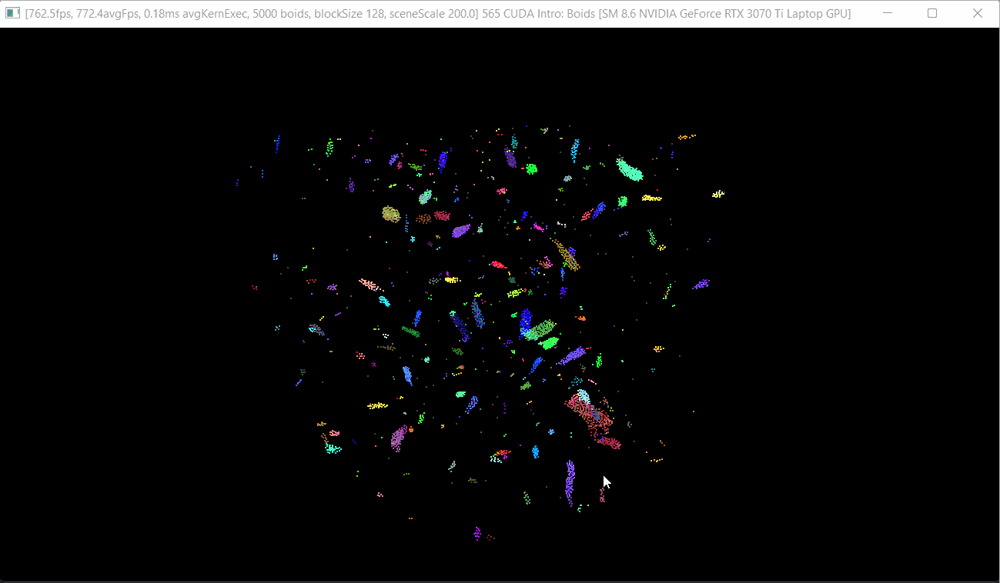

**University of Pennsylvania, CIS 565: GPU Programming and Architecture,
Project 1 - Flocking**

* Linda Zhu
  * [LinkedIn](https://www.linkedin.com/in/lindadaism/), [Portfolio](https://lindadaism.com/)
* Tested on: Windows 11, i7-12800H @ 2.40GHz 16GB, NVIDIA GeForce RTX 3070 Ti (Personal Laptop)

### Results

*Figure 1: Coherent uniform grid method - 5K boids, 200 scene scale*

*Figure 2: Coherent uniform grid method - 5M boids, 2 max speed, 200 scene scale*

*Figure 3: Coherent uniform grid method - 10M boids*

## Overview
In this project, I implemented a flocking simulation based on the Reynolds Boids algorithm by writing some simple CUDA kernels, along with two levels of optimization: a scattered uniform grid, and a uniform grid with semi-coherent memory access. I also practiced implementing performance metrics in CUDA using CPU timers or CUDA events.

### Boid Flocking

In the Boids flocking simulation, particles representing birds or fish
(boids) move around the simulation space according to three rules:

1. cohesion - boids move towards the perceived center of mass of their neighbors
2. separation - boids avoid getting too close to their neighbors
3. alignment - boids generally try to move with the same direction and speed as their neighbors

These three rules specify a boid's velocity change in a timestep.
At every timestep, a boid thus has to look at each of its neighboring boids and compute the velocity change contribution from each of the three rules. Thus, a bare-bones boids implementation has each boid check every other boid in the simulation.

#### Naive Neighbor Search

Basically for each of the `N` boids, check on every other boid in the simulation, i.e. `(N-1)` boids in total, using the three rules to compute its new velocity and update its position accordingly.

#### Scattered Uniform Grid-based Search

Based on this observation, we can see that having each boid check every other boid is very inefficient, especially if (as in our standard parameters) the number of boids is large and the neighborhood distance is much smaller than the full simulation space. We can cull a lot of neighbor checks using a data structure called a **uniform spatial grid**.

A uniform grid is made up of cells that are at least as wide as the neighborhood distance and covers the entire simulation domain. Before computing the new velocities of the boids, we "bin" them into the grid in a preprocess step so that we can use the uniform grid to reduce the number of boids that need to be checked.

#### Coherent Uniform Grid-based Search

Coherent grid search is very similar to scattered, except with one less level of indireciton. One drawback of the above method is that pointers to boids in a single cell are contiguous in memory, but the boid data itself (velocities and positions) is scattered all over the place (why it's called scattered grid simulation). In coherent grid search, we rearrange the boid data itself with additional buffers so that all the velocities and positions of boids in one cell are also contiguous in memory. This helps accesing directly using the grid cell index information.

## Performance Analysis

### Framerate change with respect to increasing boid count

From the graph we can see, no matter with or without visualization, the average FPS drops as we increase the sample boid count. As expected from the optimization purposes, coherent method has the best performance, then scattered grid method, and naive the worst, since naive is brute force search, scattered with a filter narrowing down the neightboring search targets, and coherent stacking one more layer of optimization on the hardware level, in terms of accessing data less frequently.

#### References:
1. https://developer.nvidia.com/blog/how-implement-performance-metrics-cuda-cc/