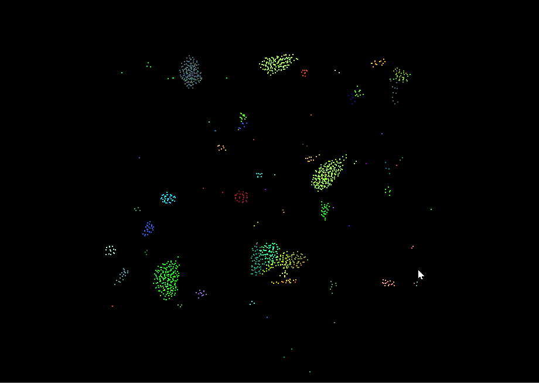
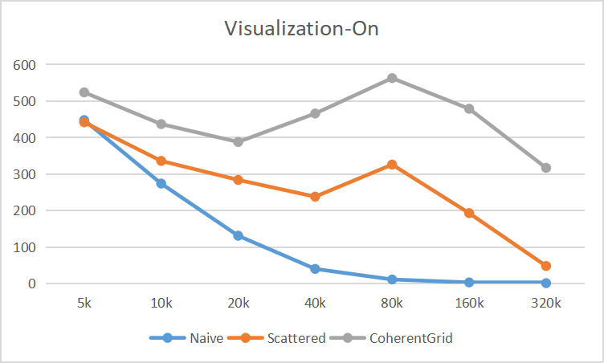
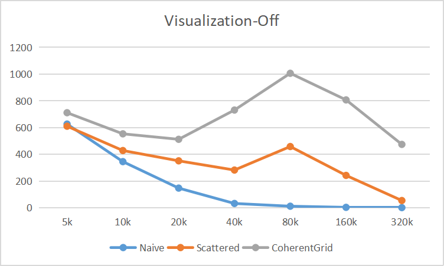
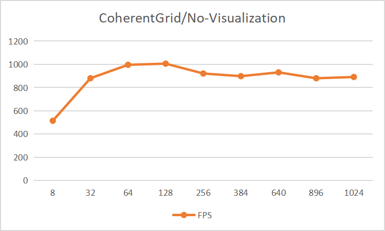
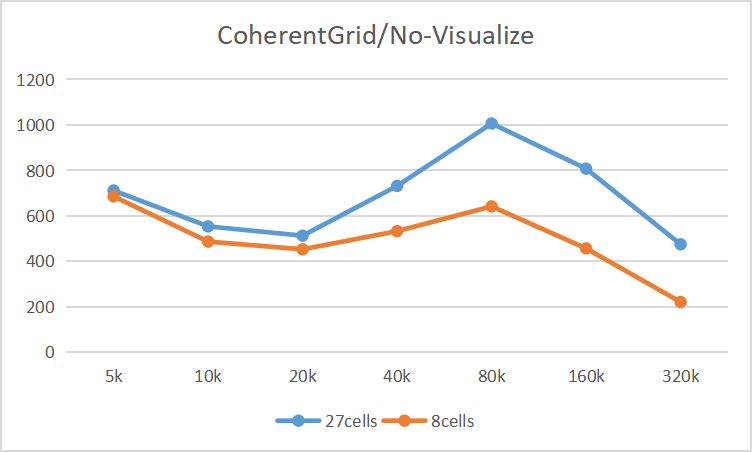

**University of Pennsylvania, CIS 565: GPU Programming and Architecture,
Project 1 - Flocking**

* Xiaoyue Ma
  * [LinkedIn](https://www.linkedin.com/in/xiaoyue-ma-6b268b193/)
* Tested on: Windows 10, i7-12700H @ 2.30 GHz 16GB, GTX3060 8GB

* Xiaoyue Ma
  * [LinkedIn](https://www.linkedin.com/in/xiaoyue-ma-6b268b193/)
* Tested on: Windows 10, i7-12700H @ 2.30 GHz 16GB, GTX3060 8GB

### Showcase

* 5k boids (naive) 

* 20k boids (naive)

* 100k boids (coherent)

### Q&A
* For each implementation, how does changing the number of boids affect
performance? Why do you think this is?
    
    Increasing the number of boids negatively affects the performance. Here's why:
    
    **Computational Overhead with Increased Neighbors:** As the number of boids increases, the number of neighbors for each boid rises as well. This means more computations are required for each boid. Despite processing in parallel, each thread still has to examine its neighbors, resulting in an increase in computation time for each thread. As a result, the performance, as indicated by average FPS, decreases.

    **Exceeding GPU Core Limitations:** The GPU has a fixed number of cores or threads available for parallel computation. If the number of boids surpasses this number, the GPU cannot handle them concurrently. Instead, it needs multiple cycles to finish the computation, leading to a performance drop.

* For each implementation, how does changing the block count and block size
affect performance? Why do you think this is?

    Changing the block count and size affects performance as follows:

    * Block sizes over 1024 are infeasible due to GPU architectural limits.
    * Performance increase obviously when block size increases from 8 to 128. However, there's only a slight boost beyond 128, up to the maximum 1024. 
    There isn't a pronounced correlation between block size and performance, potentially because utilized threads are already optimized in tested sizes.
    * Smaller block sizes see faster FPS rates. Yet, past a threshold, the FPS plateaus, possibly because initial thread increases mask memory latency, but this advantage diminishes as block sizes grow. 
    
* For the coherent uniform grid: did you experience any performance improvements
with the more coherent uniform grid? Was this the outcome you expected?
Why or why not?

    Yes, there were notable performance improvements with the coherent uniform grid. Initially, I had reservations about its efficiency, especially considering the creation of new buffers for coherent position and velocity, which I thought would add overhead due to data copying. However, results showed that especially with larger numbers of boids (e.g., around 500K), the coherent grid outperformed the scattered grid. This was surprising because the difference was more significant than expected, especially in cases with more boids. The advantage of the coherent grid became more evident as the number of boids increased. This performance improvement can be attributed to better spatial locality and reduced global memory access costs in GPU programming. 
    
* Did changing cell width and checking 27 vs 8 neighboring cells affect performance?
Why or why not?

    Changing cell width and checking 27 vs. 8 neighboring cells affects performance based on the provided data:

    **Performance Variation:** For fewer boids (below 50K), there's minimal performance difference between checking 27 cells (width=1.5d) and 8 cells (width=2d). However, with much larger boid counts (e.g., 2000K), 27 cells offer better performance.
    
    **Precision Over Speed:** Using 27 cells provides more accurate boid detection, which reduces subsequent search efforts, especially as boid numbers grow. This precision outweighs the benefits of the quicker 8-cell approach in more complex scenarios.
    
    **Increased Costs with Boid Count:** As boid numbers rise, the computational effort for checking cells and transferring data grows, affecting performance.
    
### Performance Analysis
* Average Frame Rate & Number of Boids (Visualization-On)

* Average Frame Rate & Number of Boids (Visualization-Off)

* Average Frame Rate & Block Size (Coherent Grid, 80k boids, visualization-Off)

* Average Frame Rate & 8 vs 27 Cells (Visualization-Off)

