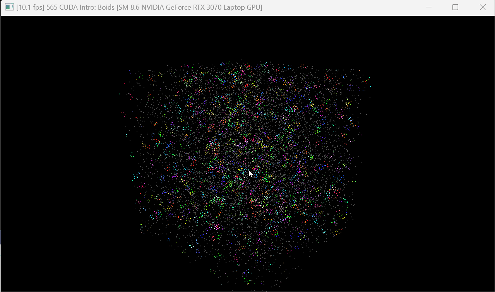
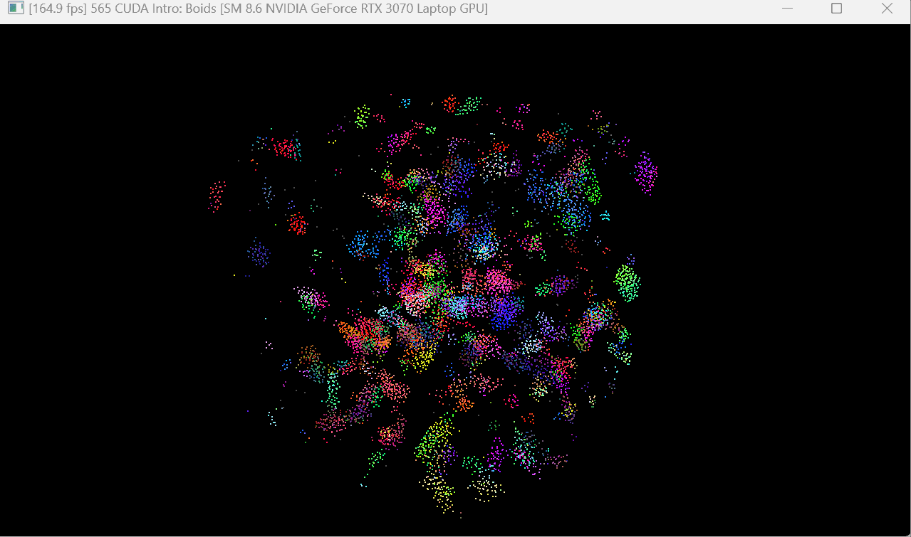
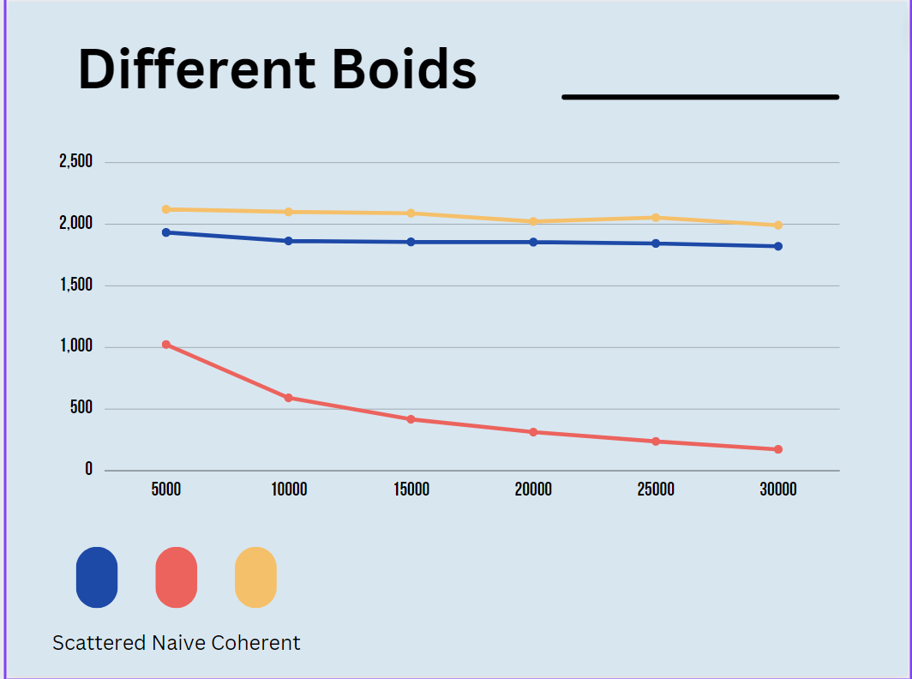
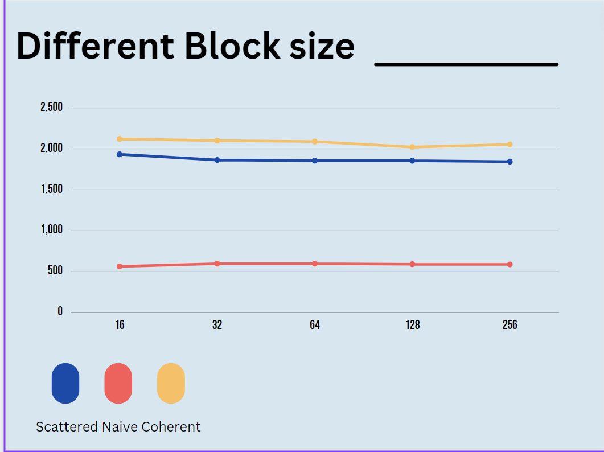

**University of Pennsylvania, CIS 565: GPU Programming and Architecture,
Project 1 - Flocking**

* Han Wang

* Tested on: Windows 11, 11th Gen Intel(R) Core(TM) i9-11900H @ 2.50GHz  22GB, GTX 3070 Laptop GPU

### Output display
The following parts are required GIF :

## NaiveGrid

## CoherentGrid

Include screenshots, analysis, etc. (Remember, this is public, so don't put
anything here that you don't want to share with the world.)

### Part3 analysis

For each implementation, how does changing the number of boids affect performance? Why do you think this is?
here are the diagram for the number of bids that affect the performance:

It is easy to see from the diagram that the number of boids largely affected the performance of the Naive search. It is because it needs to check between each other of boids to get the correct position.
However, the increase of the boids won't affect the scatter and coherent grid. It is because we only need to check the boid in the given blocks in this two methods. This would be a small number and won't affect the final output.

For each implementation, how does changing the block count and block size affect performance? Why do you think this is?

Based on the graph, it is easy to see that the block size won't actually affect the performance check. This might because though block size change might affect the number of bids that need to be checked every time,  increase the size won't cause it to change too much. 

For the coherent uniform grid: did you experience any performance improvements with the more coherent uniform grid? Was this the outcome you expected? Why or why not?

Based on the previous obvious, I don't really think the more coherent uniform grid will largely change the outcome. It is because though it can reduce the access times to the common memory and enhance the spacial continuity, the most time-consuming part is on the check boid parts. Compared to the idea of limiting the comparing times, this tries has rather unobvious output. 

Did changing cell width and checking 27 vs 8 neighboring cells affect performance? Why or why not? Be careful: it is insufficient (and possibly incorrect) to say that 27-cell is slower simply because there are more cells to check!

I would say it might affect the performance. Creating more cells might make us check fewer cells that are actually out of the rule distance. However, creating more cells costs resources. If we have rather small amount of boids to check, it is useless to create 27 cells to check 

