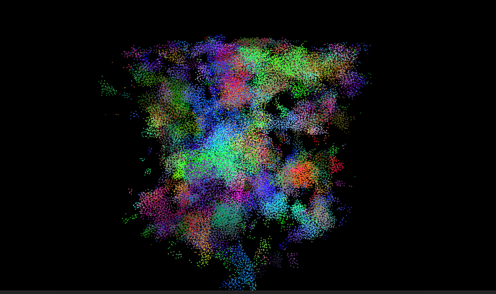

**University of Pennsylvania, CIS 565: GPU Programming and Architecture,
Project 1 - Flocking**

* Linda Zhu
  * [LinkedIn](https://www.linkedin.com/in/lindadaism/), [Portfolio](https://lindadaism.com/)
* Tested on: Windows 11, i7-12800H @ 2.40GHz 16GB, NVIDIA GeForce RTX 3070 Ti (Personal Laptop)

### Results

*Figure 1: Coherent uniform grid method - 5K boids, 200 scene scale*

*Figure 2: Coherent uniform grid method - 5M boids, 2 max speed, 200 scene scale*

*Figure 3: Coherent uniform grid method - 10M boids*

## Overview
In this project, I implemented a flocking simulation based on the Reynolds Boids algorithm by writing some simple CUDA kernels, along with two levels of optimization: a scattered uniform grid, and a uniform grid with semi-coherent memory access. I also practiced implementing performance metrics in CUDA using CPU timers or CUDA events.

### Boid Flocking

In the Boids flocking simulation, particles representing birds or fish
(boids) move around the simulation space according to three rules:

1. cohesion - boids move towards the perceived center of mass of their neighbors
2. separation - boids avoid getting too close to their neighbors
3. alignment - boids generally try to move with the same direction and speed as their neighbors

These three rules specify a boid's velocity change in a timestep.
At every timestep, a boid thus has to look at each of its neighboring boids and compute the velocity change contribution from each of the three rules. Thus, a bare-bones boids implementation has each boid check every other boid in the simulation.

#### Naive Neighbor Search

Basically for each of the `N` boids, check on every other boid in the simulation, i.e. `(N-1)` boids in total, using the three rules to compute its new velocity and update its position accordingly.

#### Scattered Uniform Grid-based Search

Based on this observation, we can see that having each boid check every other boid is very inefficient, especially if (as in our standard parameters) the number of boids is large and the neighborhood distance is much smaller than the full simulation space. We can cull a lot of neighbor checks using a data structure called a **uniform spatial grid**.

A uniform grid is made up of cells that are at least as wide as the neighborhood distance and covers the entire simulation domain. Before computing the new velocities of the boids, we "bin" them into the grid in a preprocess step so that we can use the uniform grid to reduce the number of boids that need to be checked.

#### Coherent Uniform Grid-based Search

Coherent grid search is very similar to scattered, except with one less level of indireciton. One drawback of the above method is that pointers to boids in a single cell are contiguous in memory, but the boid data itself (velocities and positions) is scattered all over the place (why it's called scattered grid simulation). In coherent grid search, we rearrange the boid data itself with additional buffers so that all the velocities and positions of boids in one cell are also contiguous in memory. This helps accesing directly using the grid cell index information.

## Performance Analysis

### Framerate change with respect to increasing boid count

From the graph we can see, no matter with or without visualization, the average FPS drops as we increase the sample boid count. As expected from the optimization purposes, coherent method has the best performance, then scattered grid method, and naive the worst, since naive is brute force search, scattered with a filter narrowing down the neightboring search targets, and coherent stacking one more layer of optimization on the hardware level, in terms of accessing data less frequently.

## Questions

**Q: For each implementation how does changing the number of boids affect performance? Why do you think this is?**

Increasing the number of boids by 10 times or exponentially leads to a significant performance drop. This is likely because given the same simulation configuration such as scene scale and search radius, the higher density of boids in each grid cell makes it necessary to perform more operations in each cell such as condition checking and calculations. The same limitation applies to all three methods we implemented: naive, scattered uniform grid and coherent uniform grid (graph to be added later). This is expected because more hardware resources are required, e.g. more threads, to handle these boid computations -- optimization in the algorithm alone won't be enough.

**Q: For each implementation, how does changing the block count and block size affect performance? Why do you think this is?**

I did not observe any big impact that modifying the block count/ size has on the performance. Since GPU threads are grouped into warps, i.e. each a collection of 32 threads, that can execute simultaneously to maximize occupancy, I chose multiples of 32 for the block size to test this starting from the defualt given value 128. However, the average FPS and average kernel execution time stay relatively constant across all three approaches, especially in the range of [256, 1024] (graph to be added later). I think the reason for this is because changing the block count/ size neither changes the number of threads actually running in parallel executing, nor the way we access data on the device. In theory, if a block size is not a multiple of 32, it will result in some threads inactive in those warps, and will cause a slowdown. Had I tried some other values not multiples of 32, I might have had more observations to reach a convincable conclusion.

**Q: For the coherent uniform grid: did you experience any performance improvements with the more coherent uniform grid? Was this the outcome you expected? Why or why not?**

Yes, I did see an obvious performance boost with the coherent uniform grid compared to the original uniform grid method with scattered boid data, let alone the naive brute-force method. This outcome is what I expected because the biggest difference of coherent grid, and also its main advantage over scattered grid, is the contiguous memory access of boid data. Reading and writing boid data stored in global memory is the slowest on GPU so freeing one level of indireciton definitely helps making the execution faster. Although we (may) need to allocate space for additional buffers to rearrange the boid data, it is only a one-time operation and cost-wise worthwhile given the time we saved from constant memory acessing.

**Q: Did changing cell width and checking 27 vs 8 neighboring cells affect performance? Why or why not? Be careful: it is insufficient (and possibly incorrect) to say that 27-cell is slower simply because there are more cells to check!**

I've only seen a slight performance improvement from checking 8 neighboring cells (avgFPS: 450, 760, 830, 780, 800 and avgKernelExecTime = 0.2ms) to 27 neighboring cells (avgFPS: 650, 740, 800, 830, 790 and avgKernelExecTime = 0.18ms), given 5K boid count and the same other defualt simulation settings (graph to be added later). I think this might be because the density of my sample boids is too sparse, only in thousands. In this case, the number of searches per grid is generally quite small, regardless of the cell width or search radius, so no big difference. I would imagine a more important impact of tightening grid cells by checking 27 neighbors when the boid count is much higher because in each grid there's fewer checks needed.

#### References:
1. https://developer.nvidia.com/blog/how-implement-performance-metrics-cuda-cc/
