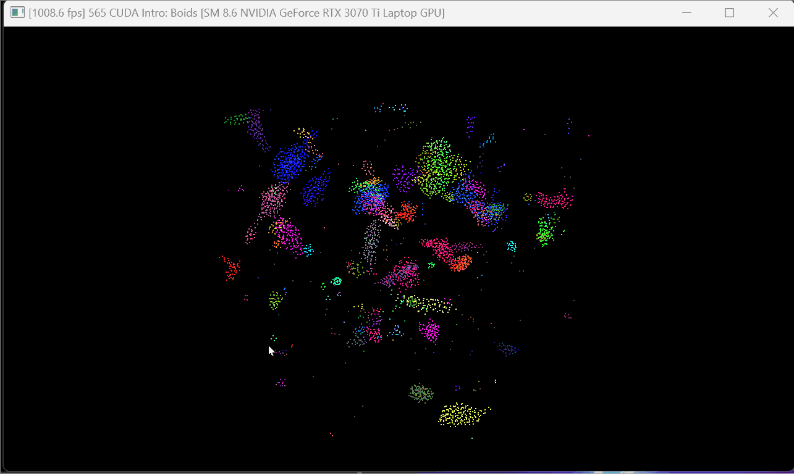
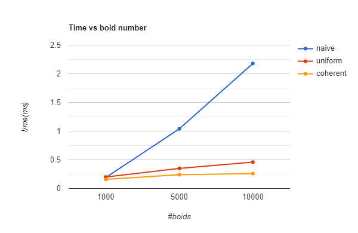
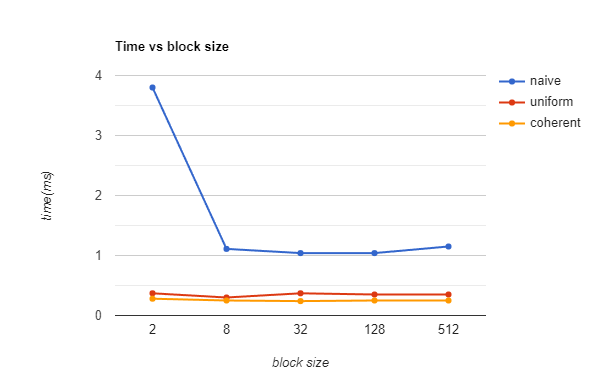

**University of Pennsylvania, CIS 565: GPU Programming and Architecture,
Project 1 - Flocking**

* Tianyi Xiao
  * [LinkedIn](https://www.linkedin.com/in/tianyi-xiao-20268524a/), [personal website](https://jackxty.github.io/), [Github](https://github.com/JackXTY).
* Tested on: Windows 11, i9-12900H @ 2.50GHz 16GB, Nvidia Geforce RTX 3070 Ti 8032MB (Personal Laptop)

### Screenshots
Below are screenshots.

With 5000 boids:

With 10000 boids:

With 20000 boids:

For all tests above, other parameters are default. (block size = 128)

### Analysis

First, I made a simple analysis with fps.

| naive  | uniform | coherent |
| :----: | :----:  | :----:   |
| 800 fps | 1600 fps | 2000 fps |

Then for all analysis below, I use CUDA event to count and estimate the execution time (in million seconds) of each simulation step. The data might not be very accurate, but should be accurate enough for analysis.

#### How does changing the number of boids affect performance?

#### How does changing the block count and block size affect performance?

#### Performance improvements with the more coherent uniform grid

#### Did changing cell width and checking 27 vs 8 neighboring cells affect performance?