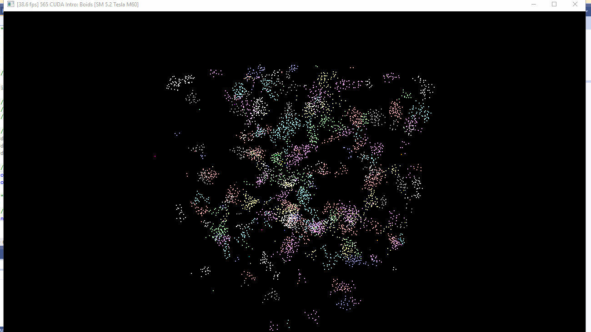
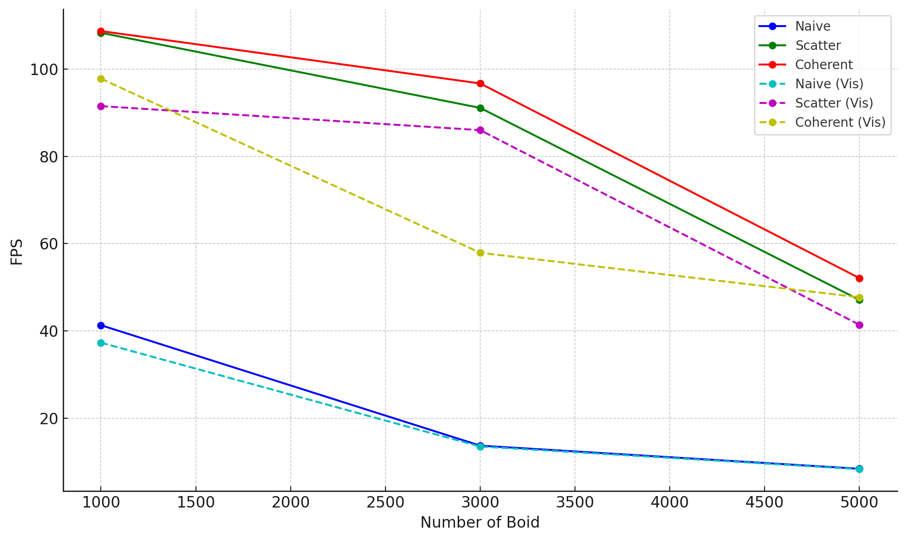
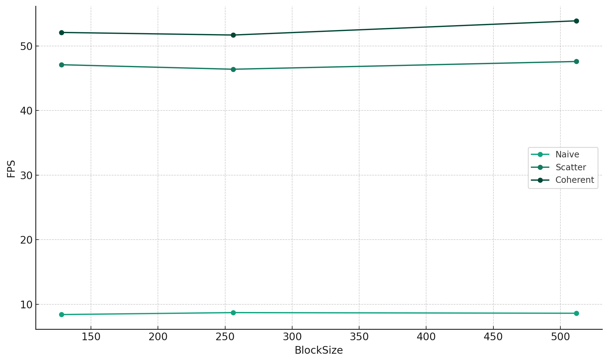

**University of Pennsylvania, CIS 565: GPU Programming and Architecture,
Project 1 - Flocking**

* Xuanzhuo Xu
  * [LinkedIn](https://www.linkedin.com/in/xuanzhuoxu/), [personal website](https://www.linkedin.com/in/xuanzhuoxu/), [github](https://github.com/PKUxxz), etc.
* Tested on: Windows Server 2019, E5-2686 @ 2.30GHz 30.5GB, Tesla M60 8GB (AWS g3s.xlarge)

### Gif demo of Coherent Grid Simulation

### Answer and relative results towards those questions

- For each implementation, how does changing the number of boids affect performance? Why do you think this is?
  Result of the number of boids vs FPS:
  
  Increasing the number of boids typically hurts the performance. Enabling the Visulization hurts the performance as well. This is because more boids mean more computation, owing to the limitation of the GPU, the FPS drops correspondingly.
- For each implementation, how does changing the block count and block size affect performance? Why do you think this is?
  
  Block size doesn't change the performance significantly. This is probably because of the total amount of computation doesn't change, and the parallelism is performed well in each size of blocks, so the performance doesn't change either.
  
- For the coherent uniform grid: did you experience any performance improvements with the more coherent uniform grid? Was this the outcome you expected? Why or why not?
  
  Yes and yes. Using coherent way performs better than any other methods, this is because of the reshuffling of the index reduces meanless computation. However, as can be seen from the graph above, when the number of boid is small, this improvement is not such significant. This is because of the overhead been reduced by coherent way is relative to the scale of the problem.
- Did changing cell width and checking 27 vs 8 neighboring cells affect performance? Why or why not? Be careful: it is insufficient (and possibly incorrect) to say that 27-cell is slower simply because there are more cells to check!
  
  It seems there's no significant difference between setting to 27 or to 8. I guess it is just because of the total computation is similar. Maybe test in larger scale will make a difference, however, the GPU is not capable to handle more number of boids.

