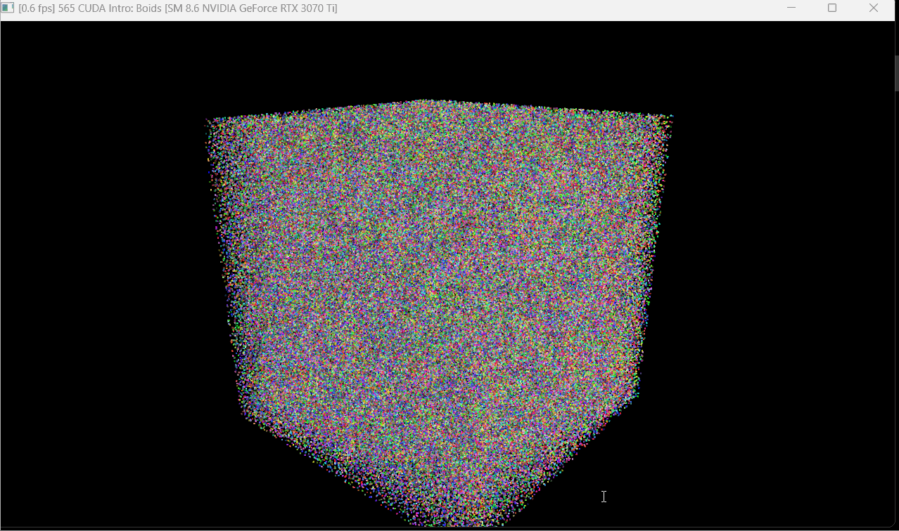
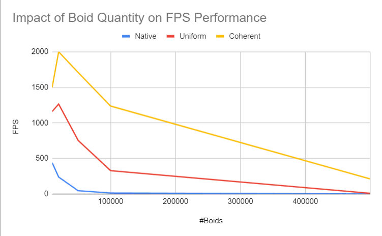
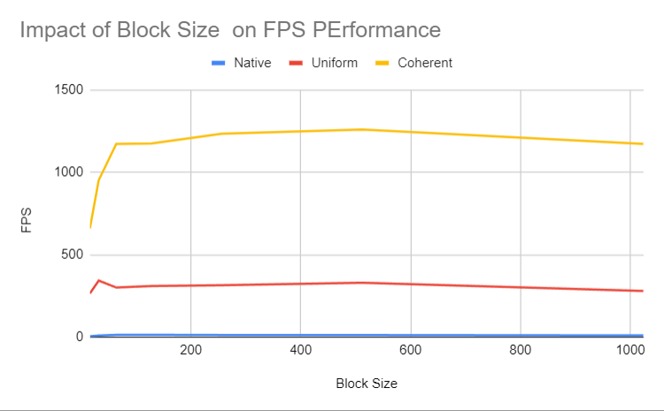

**University of Pennsylvania, CIS 565: GPU Programming and Architecture,
Project 1 - Flocking**

* Ruijun(Daniel) Zhong
    * [LinkedIn](https://www.linkedin.com/in/daniel-z-73158b152/)    
    * [Personal Website](https://www.danielzhongportfolio.com/)
* Tested on: Windows 11 pro, 12th Gen Intel(R) Core(TM) i7-12700K 3.61 GHz 32.0 GB, NVIDIA GeForce RTX 3070 Ti (personal computer)

### ScreenShots

#Boids = 10000

#Boids = 500000, Naive Search

#Boids = 500000, Scatter Uniform Grid

#Boids = 500000, Coherent Uniform Grid

### Analysis

* For each implementation, how does changing the number of boids affect performance? Why do you think this is?

    As the number of boids increases, the frames per second (fps) for all implementations decrease, which is expected because more boids mean more calculations per frame. Both the Coherent and Uniform algorithms yield higher FPS, as they are optimized for efficiency and involve fewer boid calculations.

* For each implementation, how does changing the block count and block size affect * performance? Why do you think this is?

    As we can se in the below graph, block size rises from 16 to 128, FPS improves, likely due to GPU underutilization at smaller sizes; however, beyond 128, FPS declines, possibly due to inefficiencies from limited parallelism or increased overhead.

* For the coherent uniform grid: did you experience any performance improvements with the more coherent uniform grid? Was this the outcome you expected? Why or why not?

    The Coherent implementation's performance improvement was expected becuase it reduces latency and increases throughput as it avoid repeat calculation of boid's neighbour.

* Did changing cell width and checking 27 vs 8 neighboring cells affect performance? Why or why not? Be careful: it is insufficient (and possibly incorrect) to say that 27-cell is slower simply because there are more cells to check!

    Changing the cell width and opting between 27 versus 8 neighboring cells does impact performance, but its effect is tied to boid density. For densely packed boids, checking 27 cells is more efficient as it captures more relevant neighbors. However, with fewer or sparsely distributed boids, the 8-cell approach is optimal, avoiding unnecessary computations. The best method hinges on the balance between boid density and computational efficiency.