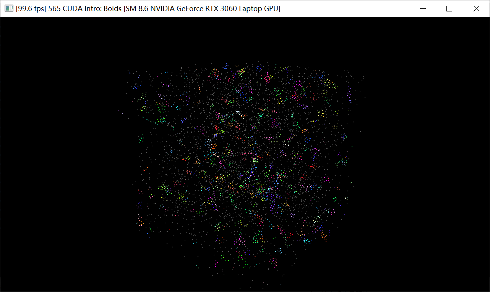
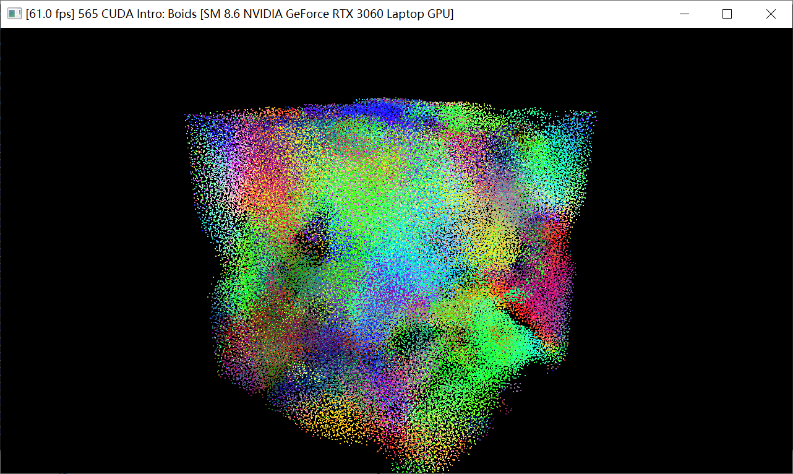
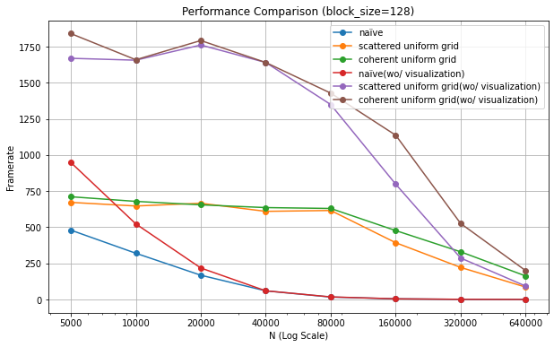
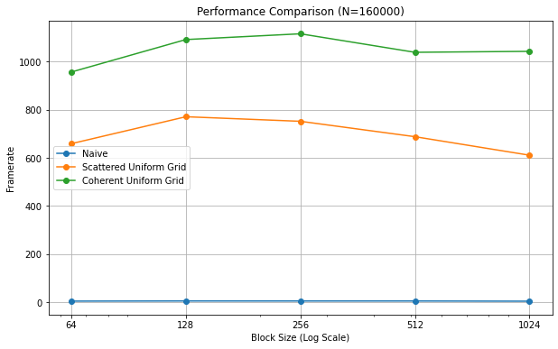

**University of Pennsylvania, CIS 565: GPU Programming and Architecture,
Project 1 - Flocking**

* Gehan Zheng
  * [LinkedIn](https://www.linkedin.com/in/gehan-zheng-05877b24a/), [personal website](https://grahamzen.github.io/).
* Tested on: Windows 10, AMD Ryzen 7 5800H @ 3.2GHz 16GB, GeForce RTX 3060 Laptop 6144MB (Personal Laptop)

## Screenshot 
* N=5000

* N=160000

## Performance Analysis

* For each implementation, how does changing the number of boids affect performance? Why do you think this is?

For both three implementation, the performance is only getting worse when the number of boids is increasing. For the first one, it is because the execution time of CUDA component is too much when N is larger, since it iterate over all particles to search for neighbors. Similarly, for uniform grid and coherent uniform grid, once N exceeds a certain threshold, the execution time of non-CUDA components, such as memory swapping, increases substantially which cannot be offset by the performance improvement of CUDA components, resulting in a decrease in FPS.

* For each implementation, how does changing the block count and block size affect performance? Why do you think this is?

When the block size is below a certain value, increasing the block size can lead to an increase in FPS, but when it exceeds this value, increasing the block size will result in a decrease in FPS. There are two possible reasons for this.

Firstly, when the block size is below a certain value, increasing the block size causes the grid size to decrease. As a result, there is a reduction in the overhead required to launch fewer blocks.

Secondly, each SM on the GPU has a limited number of SP and registers. When the block size becomes very large, it may not be possible to run all threads in a block concurrently due to these hardware limitations. Consequently, as the block size increases, FPS may decrease because not all threads can run in parallel effectively.

* For the coherent uniform grid: did you experience any performance improvements with the more coherent uniform grid? Was this the outcome you expected? Why or why not?

There is an obvious improvement in performance when using coherent uniform grid especially when the number of boids is large. This is because the coherent uniform grid can reduce the number of boids that need to be checked for each boid.

* Did changing cell width and checking 27 vs 8 neighboring cells affect performance? Why or why not? Be careful: it is insufficient (and possibly incorrect) to say that 27-cell is slower simply because there are more cells to check!

| N | 8-cell | 27-cell |
| ---------- | ------ | ------- |
| 640000        | 200    | 650     |
| 1280000        | 58    | 274     |

The result shown above using coherent uniform grid, and block size is 128.

It did change the performance. When the number of boids is large, the 27-cell version is faster than the 8-cell version. This is because $\frac{27}{2^3} < \frac{8}{1^3}$, the 27-cell version can reduce the number of boids that need to be checked for each boid.