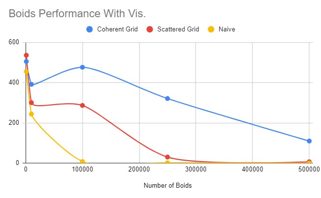
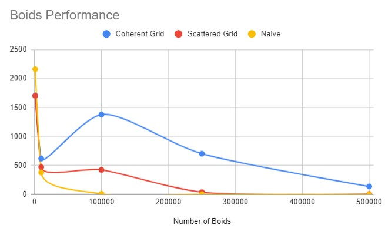
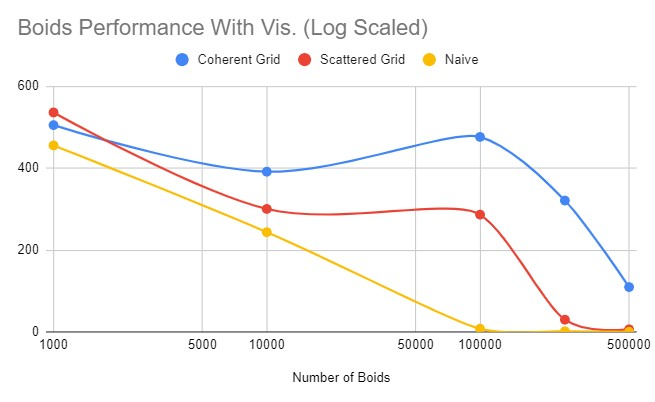
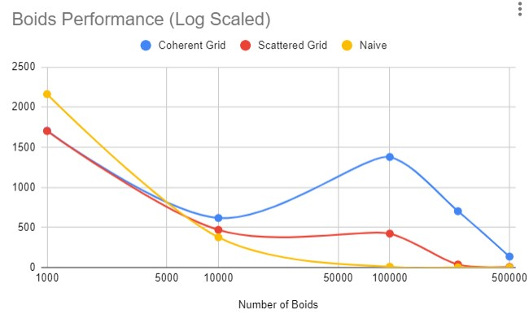
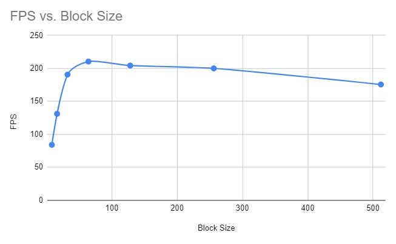

**University of Pennsylvania, CIS 565: GPU Programming and Architecture,
Project 1 - Flocking**

* Helena Zhang
* Tested on: Windows 11, i7-10750 @ 2.6GHz 16GB, Geforce RTX 2060 6GB

### Demo

Coherent Grid, 10000 boids, 128 Block Size, 100 Scene Size, Single Cell Width

Coherent Grid, 500000 boids, 128 Block Size, 200 Scene Size, Single Cell Width

### Performance Analysis
The three implementations performed drastically differently, as shown in the graphs below. All FPS data is collected from runs with **128 Block Size, 100 Scene Size, Single Cell Width**

Some patterns, such as the exponential decrease in performance in the naive implementation, can be observed from plotting the FPS on a Log Scaled X axis.

There seems to be an unexpected decrease in performance at 10K boids for all implementations. If a solution is found, this section would be updated accordingly.

In terms of block size, or the number of threads per block, smaller block sizes, especially if they are lower than 32, perform less well. The performance also gradually worsens after peaking at 64 threads per block. This data is collected from runs with **500k boids, 200 Scene Size, Single Cell Width**

### Performance Questions
* For each implementation, how does changing the number of boids affect performance? Why do you think this is?
   * The program performed slower as the number of boids increased for all implementations. As the number of boids increased, all three implementations must check for more boids in the entire scene, or more boids in each grid. With more boids for the program to check, the more warps and data read is needed, which slows the performance of the program. 

* For each implementation, how does changing the block count and block size affect performance? Why do you think this is?
   * Block count and block size only affected performance when the block size is below 32. This is because 32 is the warp size for CUDA, and having fewer than 32 threads per block would expose any latency due to slower operations like data read from global memory. 

* For the coherent uniform grid: did you experience any performance improvements with the more coherent uniform grid? Was this the outcome you expected? Why or why not?
   * There is significant improvement in performance going from uniform grid to coherent grid. This is the expected outcome because it eliminates an extra step for reading global memory data to access the index of a neighboring boid's position and velocity. 

* Did changing cell width and checking 27 vs 8 neighboring cells affect performance? Why or why not? Be careful: it is insufficient (and possibly incorrect) to say that 27-cell is slower simply because there are more cells to check!
   * Checking 27 smaller cells is more effective than checking 8 neighboring cells. This is because the large 8 neighboring cells with double the side length of a smaller cell has 2 * 2 * 2 times the volume of a smaller cell, so checking 8 neighboring large cells is equivalent to checking 8 * 8 = 64 smaller cells. 
