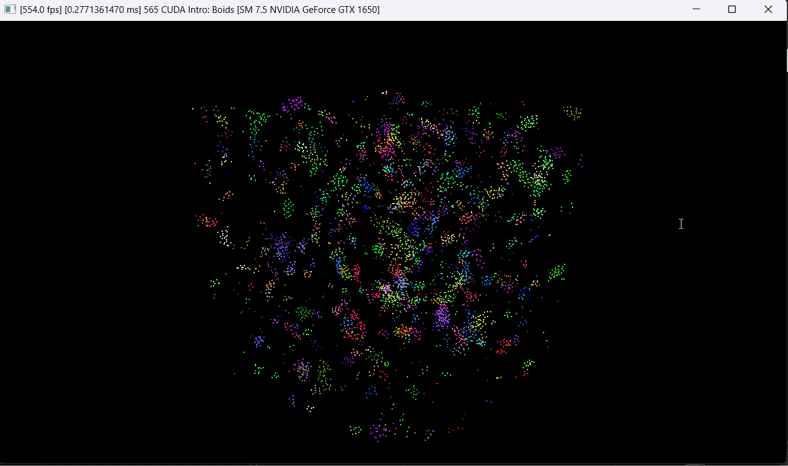
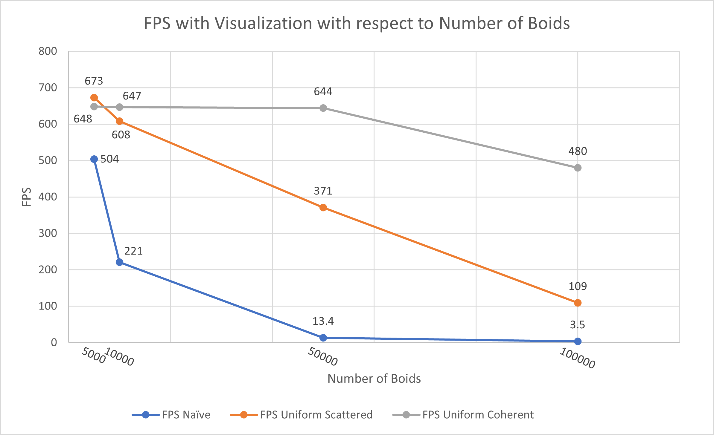
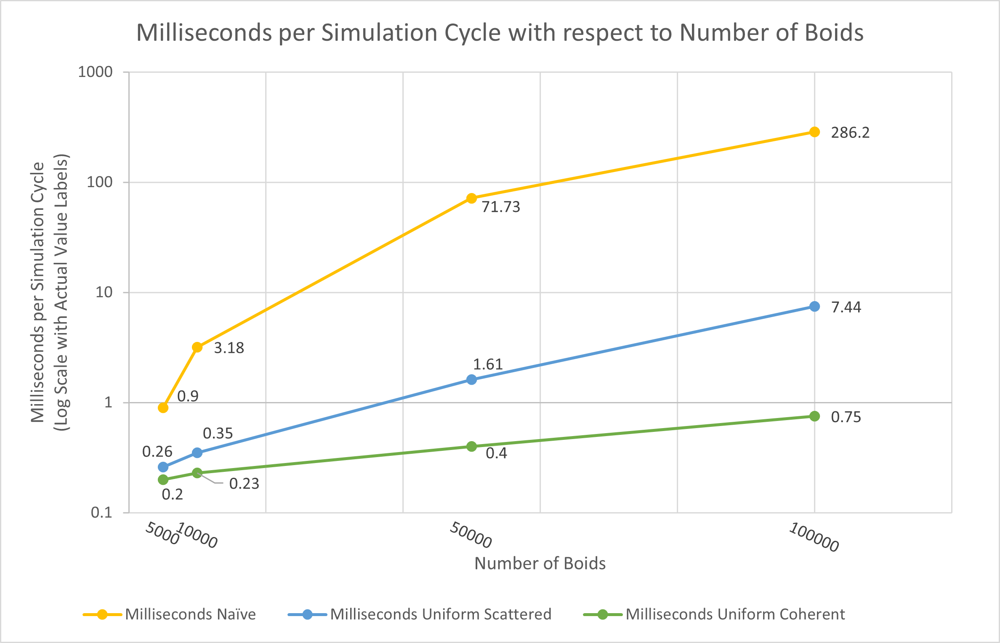
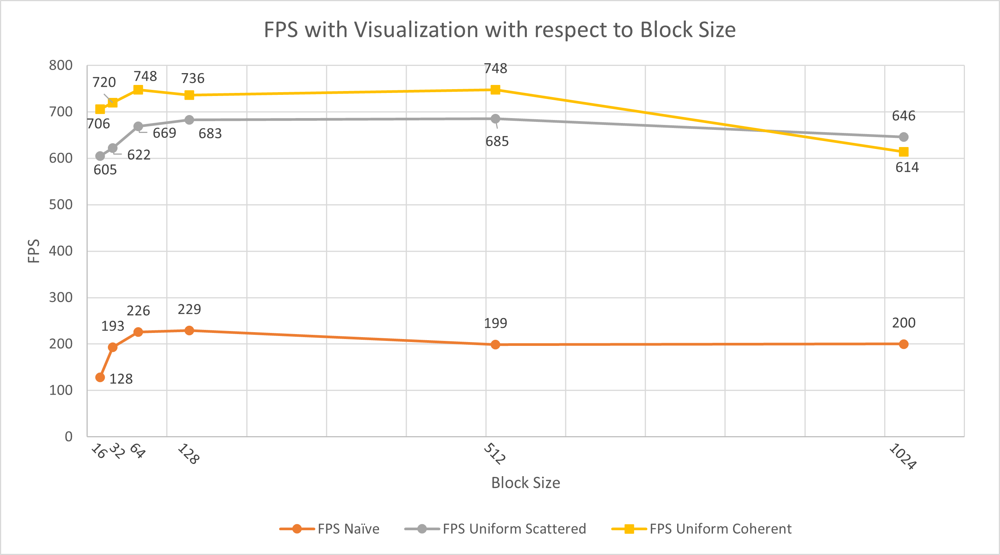
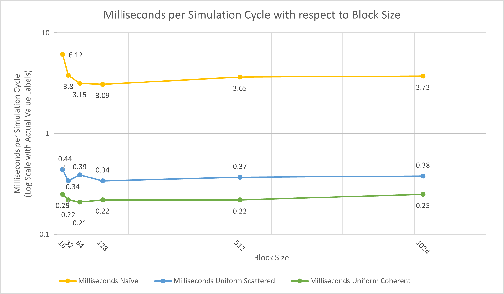

**University of Pennsylvania, CIS 565: GPU Programming and Architecture,
Project 1 - Flocking**

* Alan Qiao
* Tested on: Windows 11 22H2, i7-10750H @ 2.60GHz, 16GB, GTX 1650 (Personal)

# Flocking Simulation

This project showcases a basic flocking simulation based on Reynolds Boids algorithm. The algorithm is implemented in three ways: naive, scattered uniform grid, coherent uniform grid.

### Naive Implementation
This version implements the algorithm as a kernel function that checks every boid in the system for interaction with the selected boid. In the configuration of this simulation, the maximum distance at which an interaction occurs is small relative to the size of the universe. This results in most of those checks contributing nothing to the movement of the selected boid as they are too far away.

### Scattered Uniform Grid
This version splits the universe into a uniform grid of cubes. In each cycle, the kernel function only checks boids in the grid cells that intersect the sphere around the selected boid for which an interaction can occur. This effectively reduces the number of unnecessary checks. The boids are assigned to grid cells by pointers and the relative location of their position and velocity data remain unmoved in the respective buffers. Hence the grid is considered scattered in the sense that the data relevant to each grid cell is scattered all over the memory.

### Coherent Uniform Grid
The version is nearly identical to the Scattered Uniform Grid implementation except that the position and velocity buffers are sorted so that the boids in each grid cell appear consecutively in memory. This reduces the additional overhead of reading a pointer index from global memory in order to access the position and velocity buffers.  
It turns out that the cost of a parallelized unstable sort, which occurs once per iteration, is much cheaper than the cost of accessing global memory one extra time of every pair of interacting boids to get its index for accessing data buffers. Considering that there are up to $n^2$ pairs of interacting boids, it is likely that even if Thrust sorts in global memory, the number of global memory accesses by a nearly linear sorting algorithm is lower.

## Performance Analysis
In this section, the two primary metrics used are Frames Per Second (FPS) of the visualization with vertical synchronization turned off, and the Runtime in Milliseconds per Simulation Cycle (ms/cycle).

#### Frames Per Second (FPS)
FPS is a relatively straightforward measure where a higher FPS means a better performance. Note however that FPS does include the time of generating the visualization, which may not be an accurate representation of the performance of the flock simulation itself.  

#### Milliseconds per Simulation Cycle (ms/cycle)
To isolate the simulation time, the simulation step was wrapped in a CudaEvent to record the exact duration of one iteration of the simulation in milliseconds. This result was averaged over 300 cycles to account for some variance between the simulation time of different ticks. A lower ms/cycle indicates better performance.

### Changing the Number of Boids

Note: All simulations used a Block Size of 128.

It is clear that as the number of boids increase, the performance of all implementations decrease due to an increase in the number of computations required per simulation cycle. The naive implementation sees the fastest drop in FPS as $n^2$ pairs of boids, the most out of the three implemntations, are checked for interaction in each cycle.

It is more evident from studying the ms/cycle that both Uniform Grid implementations sees a similar growth pattern in simulation time. This is expected as the number of checks computed in both implementations are the same. The Scattered Uniform Grid implementation consistently takes longer than the Coherent Uniform Grid implementation, which supports the theory that the performance enhancement comes from reducing the number of global memory reads.

### Changing the Block Size

Note: All simulations used 5000 boids.

In general, block size should be chosen to effectively maximize the number of active warps so that all the SMs are in use and that enough warps are available to hide latencies. Given that GTX 1650 only have 14 SMs, the program needs to have 14 blocks to ensure that all the SMs are being used. With 5000 boids, this means the block size cannot exceed 357. This could explain the slight decrease in performance for a block size of 512 and 1024, although this decrease is rather insignificant.  
On the other hand, choosing block size that is too small will also hurt performance. The GTX 1650 supports a max of 16 blocks per SM and max of 1024 threads per SM. This means that if the block size is smaller than 64, then there will be unused threads, leading to less warps available for filling in the latency gaps from memory reads. This effect is clearly seen with a noticeable performance improvement from blocksize of 16 up to 64, and then tapering at 64.

### Changing the Cell Width
For the Uniform Grid implementations, one last experiment was made with the size of the cells. The two settings considered were the interaction distance and double the interaction distance. In the former case, the boids in at most 27 cells would need to be checked, while the latter would check at most 8 cells. However, checking less cells is not necessarily better as not all boids in those cells actually interact with the selected boid. The total volume covered by the 8 cells, $(4 \times maxDist)^3$, is greater than the total volume covered by the 27 cells, $(3 \times maxDist)^3$, which means there is a higher chance that the 8 cells would contain more boids, and hence potentially more boids that do not interact with the selected boid.  
Indeed, this is what was observed. In two simulations with 5000 boids and a block size of 128 using the Coherent Uniform Grid implementation, setting the cell width to double the max interaction distance resulted in 687 FPS and 0.26 ms/cycle, whereas setting the cell width to the max interaction distance resulted in 700 FPS and 0.26 ms/cycle. The effective is small, however, as difference in number of boids for either cell width is relatively small.