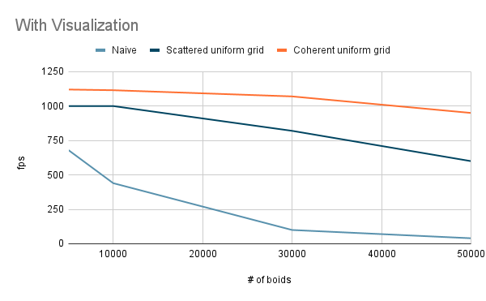
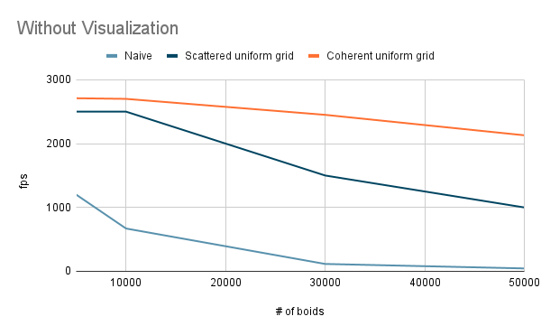
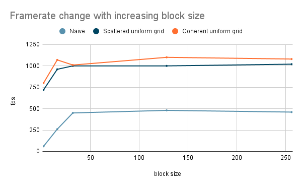

**University of Pennsylvania, CIS 565: GPU Programming and Architecture,
Project 1 - Flocking**

* Janet Wang
  * https://xchennnw.github.io/
* Tested on: Windows 11, i7-12700H @ 2.30GHz 16GB, Nvidia Geforce RTX 3070 Ti  8054MB

### Analysis
#### For each implementation, how does changing the number of boids affect performance? Why do you think this is?
As the number of boids increases, the performance slows down. For all the three methods, higher number of boids means more neighbors get involved in the velocity calculation for each boid, which increases amount of computation.
Framerate change with increasing # of boids (with visualization)

Framerate change with increasing # of boids (without visualization)

#### For each implementation, how does changing the block count and block size affect performance? Why do you think this is?
Before about 32, there is significant performance improvement when increasing blocks. However, after 64 we can hardly see the improvement anymore. I speculate that our algorithm is not using so many threads(32 is enough), and thus larger blocks do not offer advantage anymore.

Framerate change with increasing block size

#### For the coherent uniform grid: did you experience any performance improvements with the more coherent uniform grid? Was this the outcome you expected? Why or why not?
Yes, generally the coherent uniform grid has better performance in most of my test cases, as shown in all my 3 figures. And we can observe that as the number of boid increases, its advanatge is becoming greater compared with the other 2 methods. I think the reason is that as the boids data becomes very long, the complexity of indexing significantly increases, and our optimization on the indexing then contributes a lot in the reducing of complexity.

#### Did changing cell width and checking 27 vs 8 neighboring cells affect performance? Why or why not? Be careful: it is insufficient (and possibly incorrect) to say that 27-cell is slower simply because there are more cells to check!
In my test cases (up to 50,000 boids) I did not observe obvious difference between 27 and 8 neighboring cells check.
