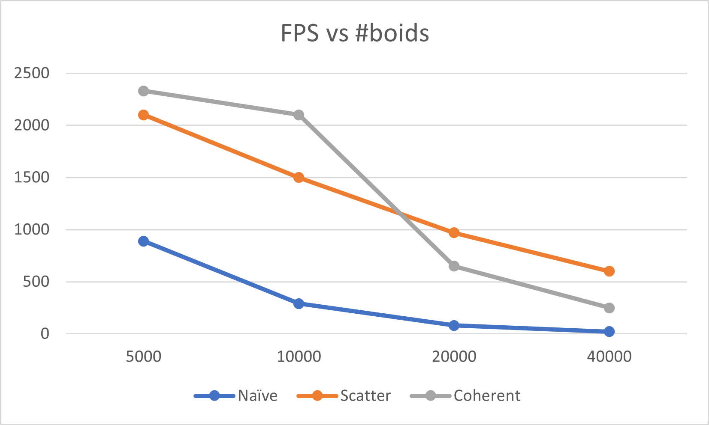
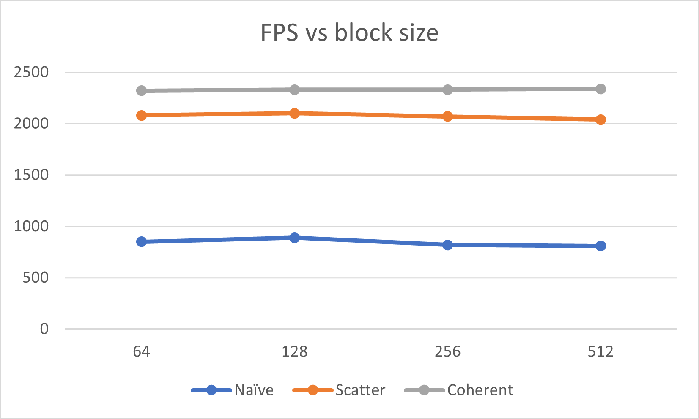

**University of Pennsylvania, CIS 565: GPU Programming and Architecture,
Project 1 - Flocking**

* Zhiyu Lei
  * [LinkedIn](https://www.linkedin.com/in/zhiyu-lei/), [Github](https://github.com/Zhiyu-Lei)
* Tested on: Windows 22, i7-2222 @ 2.22GHz 22GB, GTX 222 222MB (CETS Virtual Lab)

### Screenshots of Boids
Naive:

Scatter:

Coherent:

### Performance Analysis
#### For each implementation, how does changing the number of boids affect performance? Why do you think this is?

For all the three implementations, increasing the number of boids makes the performance worse. This is quite obvious, because more boids in total means more boids in the neighbor for each boid to consider to update its velocity, leading to more computations.

#### For each implementation, how does changing the block count and block size affect performance? Why do you think this is?

For all the three implementations, changing the block count and block size does not affect performance very significantly, because the threads can generally run in parallel.

#### For the coherent uniform grid: did you experience any performance improvements with the more coherent uniform grid? Was this the outcome you expected? Why or why not?
The more coherent uniform grid can improve performance when the number of boids is small, but cannot with a larger number of boids. The outcome met my expectation, because with a small boid number, using a coherent uniform grid results in checking contiguously in memory and thus enhancing performance; however, with a large boid number, rearanging the boid data can be more costly.

#### Did changing cell width and checking 27 vs 8 neighboring cells affect performance? Why or why not? Be careful: it is insufficient (and possibly incorrect) to say that 27-cell is slower simply because there are more cells to check!
The following table shows a comparison of FPS between checking 27 vs 8 neighboring cells. In fact, checking 27 neighboring cells with a smaller cell width (equal to the max neighborhood distance) improves performance! This is because despite more cells to check, the number of boids inside all these cells actually decreases.
#boids|8 neighboring cells|27 neighboring cells
:---:|:---:|:---:
5000|2330|2470
10000|2100|2350
20000|650|1980
40000|250|1320
