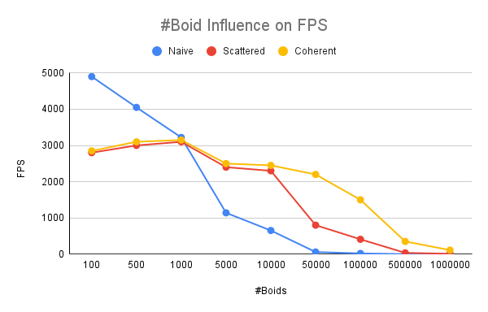
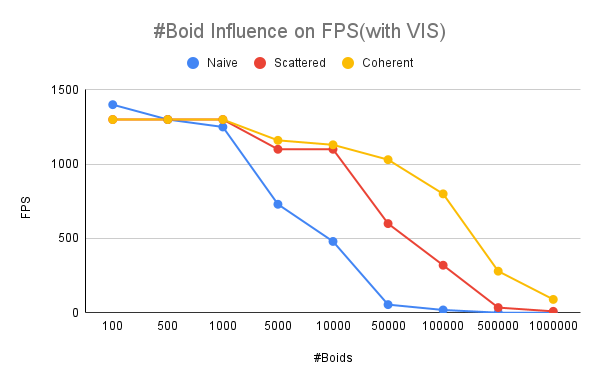
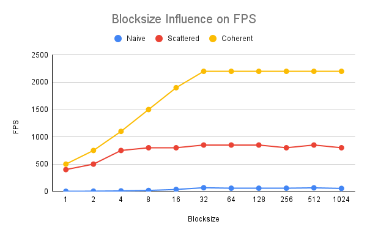

**University of Pennsylvania, CIS 565: GPU Programming and Architecture,
Project 1 - Flocking**

* Xinyu Niu
  * [personal website](https://xinyuniu6.wixsite.com/my-site-1)
* Tested on: Windows 11, i9-13980HX @ 2.20GHz 16GB, RTX 4070 16185MB (Personal)

### README

Screenshots

Figures

Figure1: FPS changes as increasing number of boids for 3 methods(without visualization)

Figure2: FPS changes as increasing number of boids for 3 methods(with visualization)

Figure3: FPS changes as increasing blocksize for 3 methods(without visualization)

### Questions

#### 1. For each implementation, how does changing the number of boids affect performance? Why do you think this is?

For all three implementations, increasing the number of boids overall reduces the performance(decreases the framerate), which we can observe from Figure1 and Figure2. This is because no matter what method we are using, increasing number of boids leads to increase neighbors of each boids, which requires more times of computation thus reduces the performance.

#### 2. For each implementation, how does changing the block count and block size affect performance? Why do you think this is?

For all three implementations, increasing block size increases the performance(increases the framerate) before the block size reach a certain value(in my case 32), after the value is reached, increasing block size doesn't affect performance significantly anymore as we can observe from Figure3. This is because blocksize less than 32, which might be the warp size, doesn't given enough threads to process, which reduces the performance. When the warp size is reached, further increase in number of threads will not increase performance significantly anymore.

#### 3. For the coherent uniform grid: did you experience any performance improvements with the more coherent uniform grid? Was this the outcome you expected? Why or why not?

By observing Figure1 and Figure2, we can find that before the number of boids reaches 10k, two uniform grid methods don't show too much difference in performance, but when number of boids is greater than 10k, coherent uniform grid method shows significant performance imporvements compare to the other method. I expect this be true because as number of boids be large enough, cost for indexing becomes a considerable part accounting for the total computation cost, thus coherent uniform grid, which avoids indexing for each neighbor check, could improve performance significantly compare to the other method.

#### 4. Did changing cell width and checking 27 vs 8 neighboring cells affect performance? Why or why not? 

Checking 27 cells improves the performance in the case that boids are dense in the grid. This is because when boids are dense, it is more directly and efficient to check each cell rather than try to calculate neighbors.