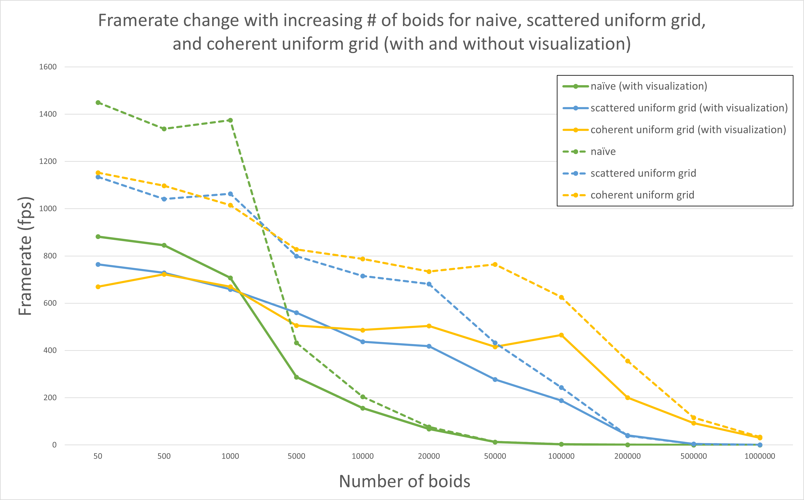
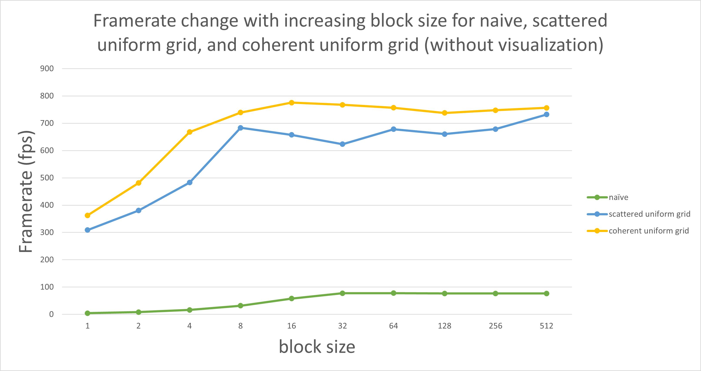

**University of Pennsylvania, CIS 565: GPU Programming and Architecture,
Project 1 - Flocking**

* Tong Hu
  * [LinkedIn](https://www.linkedin.com/in/tong-hu-5819a122a/)
* Tested on: Windows 11, Ryzen 7 1700X @ 3.4GHz 16GB, GTX 1080 16GB (Personal Computer)

# Flocking

This project running the flocking simulation in naive, scattered uniform grid, and coherent uniform grid methods.

## Visualization
Figure 1. Flocking simulation with 5000 boids.

Figure 2. Flocking simulation with 20000 boids.

Figure 3. Flocking simulation with 50000 boids.

## Performance Analysis

### For each implementation, how does changing the number of boids affect performance? Why do you think this is?
Figure 4. Framerate vs. Number of boids.

This analysis is done with block size as 128. 

As shown in Figure 4, we can tell that for each implementation, with or without visualization, when the number of boids increased, the framerate decreased. This make sense since when the number of boids increased, the number of neighbors used for updating velocities and positions increased as well, which cost more time to calculate.

Also, we can notice from the figure that when the number of boids is small (smaller than 5000), the performance of naive implementation is better than uniform grid. Since there are not much boids and distribution of boids is very scattered, it is not necessary to find out which grid should be included when calculating velocities and positions, which introduced unnecessary overhead. 

As the number of boids increased (greater than 5000), the naive implementation have to traverse all boids and compare the distance to determine which boid should be included. This calculation and comparisons are not necessary for most boids, while split the spaces into grid can prevent doing these unnecessary work, which can improve the performance of simulation. 

### For each implementation, how does changing the block count and block size affect performance? Why do you think this is?
Figure 5. Framerate vs. Block size.

This analysis is done in number of boids as 20000.

From Figure 5 we can tell that when the block size is smaller than 32, increasing block size improved the performance for all three implementations, while the block size is greater than 32, the performance became stable (almost not change) as the block size increased. 

This is related to the warp size, which defines the maximum number of threads can be contained in a warp, and a warp is the smallest unit for scheduling. In my GPU, the warp size is 32 threads. If the block size is smaller than 32, the remaining threads in the warp remain idle but occupy scheduling resources, which cause the whole process take more time. When the block size is greater than 32 threads, all threads are in use, and it will not be a bottleneck of the performance.

### For the coherent uniform grid: did you experience any performance improvements with the more coherent uniform grid? Was this the outcome you expected? Why or why not?

Based on Figure 4, we can tell that the performance improved with more coherent uniform grid compared with scattered uniform grid, especially when the number of boids is large. This improvement matched the expectation since instead of getting velocity and position data by randomly access buffers, we rearranged the buffer so that the data of boids which located closely in the same grid are put together. Hence the memory access is more efficient due to spatial locality, which improve the performance by reducing the number of random access to memory.

### Did changing cell width and checking 27 vs 8 neighboring cells affect performance? Why or why not?

I expect checking 27 neighboring cells with cell width as the distance for checking rules will improve the performance of simulation, especially when the number of boids is large. When we are checking 8 neighboring cells with cell width as $2$ times the distance, we are checking the boids within $(4)^3 = 64$ unit space. But if we changing the cell width to $r$ and check 27 cells, we are checking the boids within $(3)^3 = 27$ unit space, which is actually smaller than previous. Although checking more cells will introduce some extra overheads (sorting, determine cells and some other overheads), they are negligible compared with the improvement. Thus, I expect checking 27 neighboring cells will improve the performance.