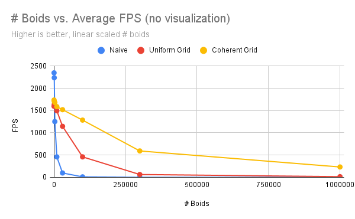
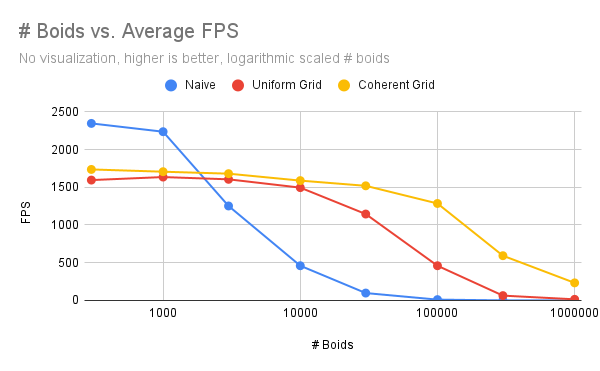
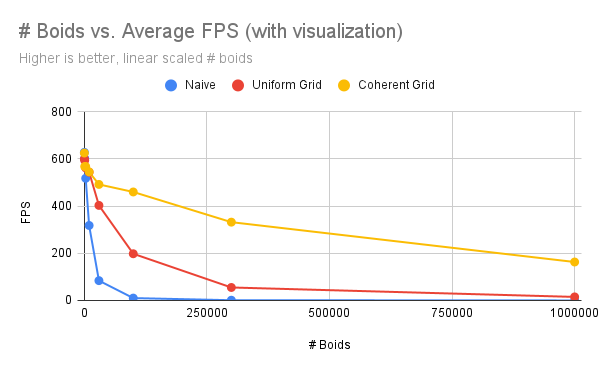
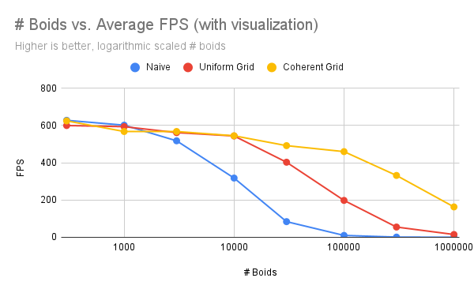
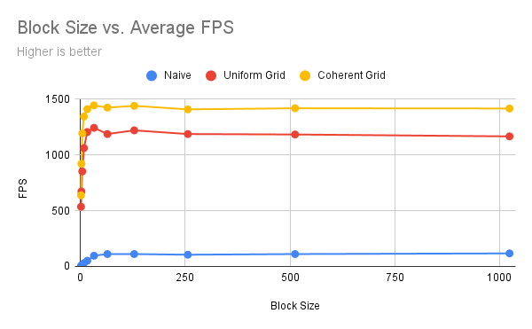
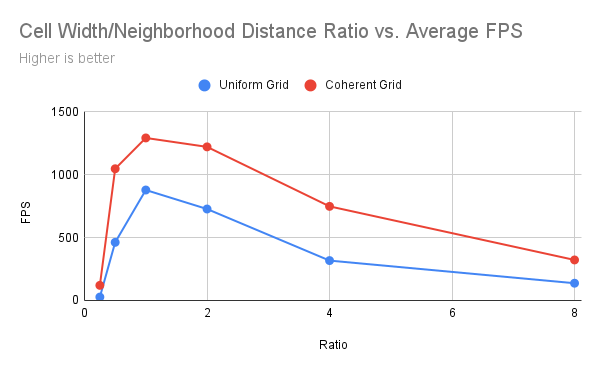

**University of Pennsylvania, CIS 565: GPU Programming and Architecture,
Project 1 - Flocking**

* Aditya Gupta
  * [Website](http://adityag1.com/), [GitHub](https://github.com/AdityaGupta1), [LinkedIn](https://www.linkedin.com/in/aditya-gupta1/), [3D renders](https://www.instagram.com/sdojhaus/)
* Tested on: Windows 10, i7-10750H @ 2.60GHz 16GB, NVIDIA GeForce RTX 2070 8GB (personal laptop)
  * Compute capability: 7.5

## Introduction

*Boids* is a simulation in which particles representing agents like birds or fish (boids) move around the simulation space according to three rules:

1. *cohesion* - Boids move towards the perceived center of mass of their neighbors.
2. *separation* - Boids avoid getting to close to their neighbors.
3. *alignment* - Boids generally try to move with the same direction and speed as their neighbors.

Some example simulations:

||
|:--:|
|*5,000 boids, scene scale = 100*|

||
|:--:|
|*50,000 boids, scene scale = 100*|

||
|:--:|
|*500,000 boids, scene scale = 200*|

||
|:--:|
|*5,000,000 boids, scene scale = 400*|

## Implementation and Performance

A naive implementation could have each boid check every other boid to determine its new velocity, for which the runtime increases exponentially. Especially on the CPU, this quickly leads to severe performance limitations. However, optimizations can be made:

- Using the GPU allows for significant parallelization, which confers a massive speedup by itself.
- Constructing a uniform grid data structure reduces each boid's neighbor checks from O(n) to O(1).
- Rearranging buffer layouts for more contiguous memory access further increases performance.

We now compare the performance of the naive GPU method, uniform grid method, and coherent grid method, as well as of various other parameters.

### # Boids vs. FPS

<table>
  <tr>
    <td></td>
    <td></td>
  </tr>
  <tr>
    <td colspan="2" align="center"><i>scene scale = 100, block size = 128, single-width cells</i></td>
  </tr>
</table>

<table>
  <tr>
    <td></td>
    <td></td>
  </tr>
  <tr>
    <td colspan="2" align="center"><i>scene scale = 100, block size = 128, single-width cells</i></td>
  </tr>
</table>

In both cases, the naive method is faster for very small numbers of boids since it does not need to construct the grid data structure. However, its runtime quickly declines, and the coherent grid method is the clear winner overall.

### Block Size vs. FPS

||
|:--:|
|*30,000 boids, scene scale = 100, single-width cells, no visualization*|

Similar to the previous comparison, the coherent grid method is the best overall. As for block sizes, increasing the block size past 32 had little effect on performance. However, block sizes under 32 decreased performance, dropping lower with smaller block sizes. This is likely because the warp size is 32, so block sizes less than that are sub-optimal and require more scheduling work.

### Grid Cell Size vs. FPS

||
|:--:|
|*50,000 boids, scene scale = 100, block size = 128, no visualization*|

The size of grid cells relative to the neighborhood distance also has an impact on performance. A ratio of 1 turned out to be best. This makes sense as having more cells would mean additional overhead for sorting and searching those cells, while having less cells would require searching through significantly more boids per cell.

### Performance Questions

**For each implementation, how does changing the number of boids affect performance? Why do you think this is?**

Increasing the number of boids while keeping all other factors constant almost always decreased performance. This is because with more boids in the same space, each boid has to take more boids into account when calculating its own change in velocity. Even for the grid-based methods, there will be more boids to consider within the grid cells surrounding any one boid.

**For each implementation, how does changing the block count and block size affect performance? Why do you think this is?**

As stated above, increasing the block size past 32 had little effect on performance. However, block sizes under 32 decreased performance, dropping lower with smaller block sizes. This is likely because the warp size is 32, so block sizes less than that are sub-optimal and require more scheduling work.

**For the coherent uniform grid: did you experience any performance improvements with the more coherent uniform grid? Was this the outcome you expected? Why or why not?**

The coherent grid resulted in significant performance improvements over the regular uniform grid. I expected this outcome since memory access becomes more contiguous and the code performs fewer array indirections, but I did not expect how drastic the performance improvement would be. Especially for 1,000,000 boids, the difference of 2 FPS and 124 FPS is enormous. I think I underestimated how important proper memory access can be for this kind of project.

**Did changing cell width and checking 27 vs 8 neighboring cells affect performance? Why or why not? Be careful: it is insufficient (and possibly incorrect) to say that 27-cell is slower simply because there are more cells to check!**

Checking 27 cells instead of 8 actually increased performance. Though it did mean each boid had to check more cells, the boids within those cells were much more likely to be within the neighborhood distance. The reduction in unnecessary boid checks more than made up for the increased cost of searching extra cells.
