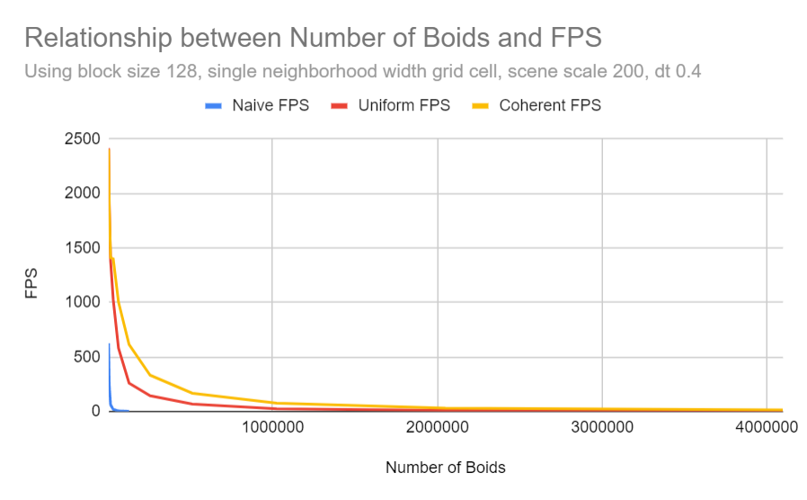

## **University of Pennsylvania, CIS 565: GPU Programming and Architecture, Project 1 - Flocking**

Jason Li   ([LinkedIn](https://linkedin.com/in/jeylii))
* Tested on: Windows 10, i7-12700 @ 2.10GHz 32GB, NVIDIA T1000 (CETS Virtual Lab)
* Captured on: Windows 10, Ryzen 5 3600X @ 3.80GHz 32 GB, NVIDIA RTX 4070 

 | 
|:--:| 
| *4M Boids* |

 | 
|:--:| 
| *500K Boids* |

 | 
|:--:| 
| *10K Boids* |

## **Implementation and Performance Analysis**

Three different implementations of boid flocking are considered:
- A naive implementation, where each boid checks every other boid for an influence on its velocity;
- An implementation using a uniform grid, where each boid checks the grid cells in its neighborhood for boids which may influence its velocity;
- An implementation using a coherent grid, where each boid checks the grid cells in its neighborhood, which are continuous in memory, for boids which may influence its velocity.

**In addition, for extra credit, grid-looping optimization was implemented.** For the uniform grid and coherent grid implementations, we check between the min and max grid indices in each dimension within the largest neighborhood distance, essentially drawing and checking within a cube circumscribed around the sphere centered around the boid of the largest neighborhood distance. This prevents excessive grid cell position checks, and allows the grid width to scale indefinitely. This however does not completely eliminate unnecessary grid cell checks, for example in the situation illustrated by the diagram below. It comes close enough however as checking whether a grid cell lies within the sphere centered around the boid is much more complex. 

Below we analyze the performance differences between these three implementations.

### **Performance for Increasing Number of Boids**

 

We can see in the above two figures that generally, when increasing the number of boids, the performance (measured here by FPS) of each implementation decreased. We can also see an extremely significant difference in performance between the "naive" implementation and the two grid implementations. Note that as shown in the figure using a log scale, the difference in performance between the coherent grid implementation and the uniform grid implementation seems to be negligible until about 20000 boids, after which the coherent grid implementation clearly pulls ahead.

### **Performance for Different Block Sizes**

In this above figure, we can see the impact of differing block sizes on the performance of the simulation while holding all other variables constant. For block sizes from 4 up to 128, we can see a significant increase in performance when increasing the block sizes, but after 128, there does not seem to be a significant difference between performance when increasing block size further.

### **Performance for Different Grid Cell Width**

In this above figure, we can see the impact of differing grid cell width on the performance of the simulation while holding all other variables constant. For this analysis, we are taking grid cell width as its ratio to the maximum neighborhood size we are checking. We can see here that 1 seems to be the optimal ratio, as sharp performance drops are observed on either side of this ratio value.

## **Q&A**

#### **For each implementation, how does changing the number of boids affect performance? Why do you think this is?**

For all implementations, the number of boids in the simulation has an inverse relationship with performance. The performance decreases when adding more boids as each boid must consider a larger number of boids during its velocity calculations. When using the grid optimizations, each boid still must consider more boids in its velocity calculations as there is a greater number of boids in its neighboring grid units.

#### **For each implementation, how does changing the block count and block size affect performance? Why do you think this is?**

For each implementation, it seems that increasing the block size has large improvements on performance between the block sizes of 4 and 128. However, after reaching 128, no further improvements on performance were seen; instead, a very slight decrease in performance was exhibited. When block size is very small (4-64), large increases in performances are probably seen due to the warp size being 32. When the block size is smaller than the warp size, scheduling is not efficient as less threads than the warp size are scheduled at any one time. However, once we go past the warp size of 32, further improvements in block size could be explained by less scheduling overhead, but these are very small.

#### **For the coherent uniform grid: did you experience any performance improvements with the more coherent uniform grid? Was this the outcome you expected? Why or why not?**

When using the coherent uniform grid over the normal uniform grid, large performance improvements were observed. Note that this performance improvement was not observed until about 20000 boids. This is most likely because the extra work of pre-reordering the position and velocity buffers is not worth it with a low number of boids; however, once we increase the number of boids exponentially, the benefits of having the contiguous boid data can clearly be seen. This large increase in performance is likely due to much less cache misses while accessing the memory buffers in order.  

#### **Did changing cell width and checking 27 vs 8 neighboring cells affect performance? Why or why not? Be careful: it is insufficient (and possibly incorrect) to say that 27-cell is slower simply because there are more cells to check!**

Adjusting the cell width to 1 * the maximum neighborhood width and thus checking 27 neighboring cells was a large performance increase; however, adjusting the cell width to either side of the ratio of 1 was a performance hit. This is because when reducing the grid width, the number of boids in neighboring grid cells that are checked but are not within the neighborhood of each boid is greatly decreased, leading to much less unnecessary boids checked and calculations performed. 

Even though a larger number of grid cells were checked for each boid, the proportion of boids within these grid cells which were a factor in the boid's velocity was much greater, meaning the efficiency of these checks was greatly increased. However, when we make the grid width too small, performance decreases as we are now checking an excessive number of grid cells, and when we make the grid width larger, performance decreases as the proportion of boids in each grid cell which are within the boid's neighborhood is much less, so the efficiency of checks is much lower. It seems that the ratio of 1 is the "sweet spot" for the parameters chosen in this analysis; however, this could be different for varying values of neighborhood distance and boid count.
