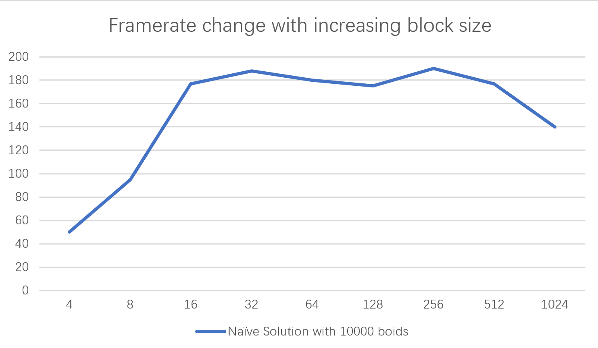

**University of Pennsylvania, CIS 565: GPU Programming and Architecture,
Project 1 - Flocking**

* Hanting Xu
  * [GitHub](https://github.com/HantingXu), [LinkedIn](www.linkedin.com/in/hanting-xu-25615b28b).
* Tested on: (Personal Computer) Windows 11, i7-12700H @ 2.70GHz 32GB, GeForce RTX 3070 Ti Laptop GPU
### Feature Implemented
* Naive Neighbourhood Search
* Scattered Grid Search
* Coherent Grid Search
* Grid-Looping Optimization
### Performance Analysis
* According to my observation, boids number have great influences on the performance. In this test, I used different search methods and tested their respective framerate change with the increasing number of boids. As the result shown below (y-axis means the framerate per second, x-axis means the number of boids), the performance of each three methods drops as the boid number increases.

* Block size can also influence the performance. In this test, I record the framerate change of the simulation with different block size. To make this possible influence visible, I choose to use the Naïve Solution with 10000 boids. The result under this setting shows that the performance keeps to increase when the block size goes from 4 to 16. And it drops as the block size goes beyond 256.The graph (y-axis means frame per second, x-axis means the block size) below well demonstrates this change. This change is probably because of the reason that at the beginning more threads are able to share the work, the performance rises. However, as there are more threads participating, they begin to compete for the shared memory and start to block one another. In this case, the performance drops.

* With the coherent grid, the performance is drastically improved. However, this change is not expected before. Considering the time in reshuffling and memory transferring between different buffers, I thought coherent grid method would take longer time than the scattered one. This is probably because we need to obtain the boids in the grids for so many times that this conversion in index accumulates increasingly over each search that dwell the time spent in reshuffling and memory copying in each frame.
* For whether checking 8 cells is more efficient than checking 27 cells, I think it depends. Even though checking 27 cells seems to have more overheads, we don’t necessarily have to check all 27 cells. Sometimes we only need to check the surrounding 8, 12 or 18 cells in this setting. Each of these cells is of smaller size in comparison to 8-cell situation and each of them possibly contains less boids. Thus if we have a 27-cell bounding box, it is possible that we can check less boids than that in 8-cell setting.
### Screenshots
* 5000 particles with coherent grid

* 10000 particles with coherent grid

* 50000 particles with coherent grid

* 250000 particles with coherent grid

